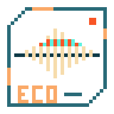
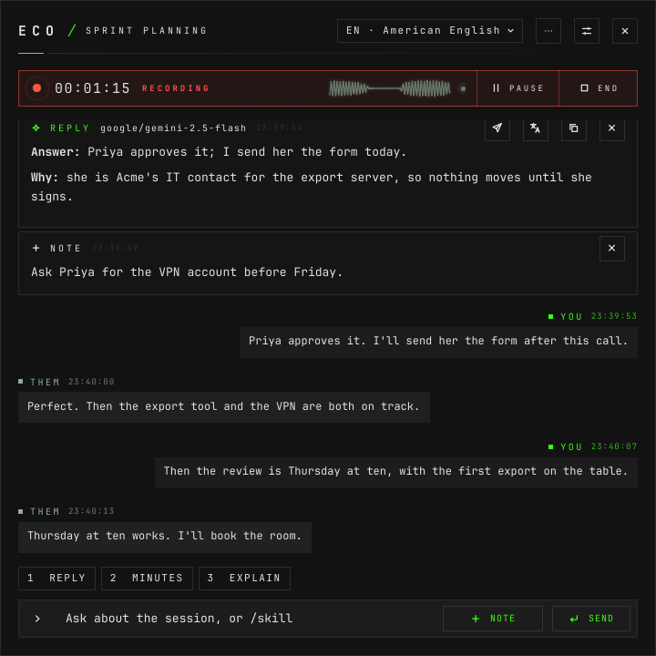
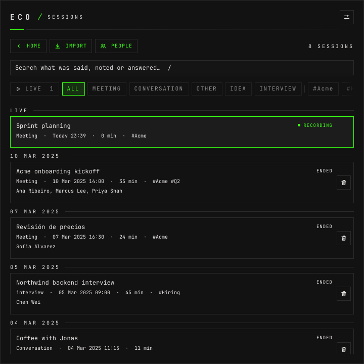
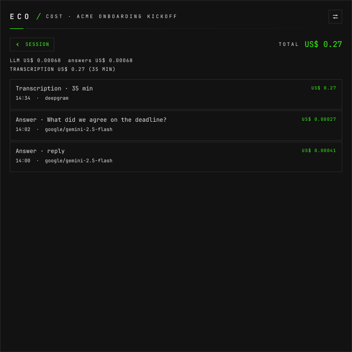
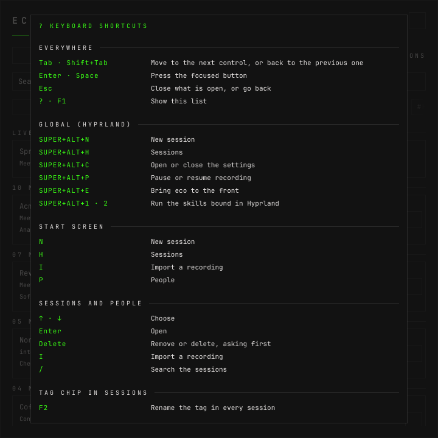

# eco



Voice sessions with an AI beside them, for Omarchy. A meeting, a conversation, a
class or an idea said out loud is a **session**: eco hears it, transcribes it
line by line with who said it, and answers about it — a reply to suggest, the
minutes, one fact — while it happens or a month later. The session is a text
log on the laptop; the audio is heard and never kept.





Two processes. The daemon (`src/`, Rust) captures, transcribes, keeps the
sessions and calls the models; the window (`overlay/`, QML on Qt 6, run by
the small `eco-window` program) only draws what the daemon sends it, over one Unix socket at
`$XDG_RUNTIME_DIR/eco.sock`. The interface speaks English, Brazilian Portuguese
and Japanese.

## Install

Not published as an Omarchy default yet. From the latest GitHub release:

```bash
curl -fsSL https://raw.githubusercontent.com/This-Is-NPC/eco/master/install.sh | bash
```

It downloads the release's Arch package, checks it against the release's
`SHA256SUMS` and installs it with `pacman -U`; `sudo pacman -R eco` takes it
off again. `VERSION=0.1.0` picks a release other than the latest.

The package puts the binary, its window, the Hyprland rules and keys, the
launcher and icon, the licence and a user service (written and not enabled) on
the machine. It also installs completions of `eco` for bash, zsh and fish. `eco setup --harnesses agents,claude-code` then downloads the VAD
and speaker models, adds the one line to `~/.config/hypr/bindings.lua` that
loads the Hyprland rules, and publishes the `eco` skill for agents. **Removing the package keeps the
config, the sessions, the people, the models and the agent skill** — removing
the program is not a reason to lose a year of meetings.

Released under the MIT license. [How to install it, and how to take it off
again](docs/how-to-install-and-remove.md) is the whole of it.

## Start here

The daemon will not start without `~/.config/eco/config.toml`; the smallest one
that starts is in [the install page](docs/how-to-install-and-remove.md#3-write-a-first-config),
and from then on the settings window writes it for you. Then, in the window:

1. `SUPER+ALT+C` opens the settings. **Audio** first: one audio source for you
   on the default microphone, marked THIS IS ME, and one for everybody else on
   the default output — what the laptop plays.
2. **Models**: a chat model and a transcription model, each named once. Their
   keys come from the daemon's environment (`OPENROUTER_API_KEY`,
   `DEEPGRAM_API_KEY`, `ELEVEN_LABS_API_KEY`, `GROQ_API_KEY`, `OPENAI_API_KEY`,
   kept in `~/.config/uwsm/env`) or from your omapass keyring.
3. **NEW SESSION** on the start screen, or `SUPER+ALT+N` from anywhere: a title,
   a kind, a language, START.

The same daemon answers a terminal:

```bash
eco status
```

```
eco: daemon running (pid 434054, version 0.1.0)
```

```bash
eco sessions --search "VPN" | jq -c '.data | map({id,title,tags})'
```

```json
[{"id":"90a8bbae6b73","title":"Acme kickoff","tags":["Cliente Acme","Onboarding"]}]
```

```bash
eco ask c7fe3528d507 who tells the pilot customers?
```

```
{"ok":true,"data":{"session":"c7fe3528d507","id":"1e903aa0","action":"chat","prompt":"who tells the pilot customers?","model":"google/gemini-3.5-flash-lite","text":"Leo.","ttft_ms":1538,"total_ms":1627}}
```

The ids are placeholders; `eco sessions` lists yours. Every command but
`setup`, `bench` and the four that manage the daemon prints one JSON object on
one line.

**Sessions are append-only logs.** One file each, in
`~/.local/share/eco/sessions/`, one JSON object per line. A corrected line, a new title or a removed answer is
one more record, never an edit — and a removed answer also leaves the context
of every later question. `--no-save` keeps a session in
memory only.

**The audio is never written to disk.** Outside a session the inputs are only
measured, for the trace on the start screen. Inside one, the lines are kept as
text; voices are kept as numbers that describe them, and an imported file is
decoded through a pipe.

**The window never holds a secret.** Only the daemon reads keys, when it builds
a provider; the window sends a draft of the settings and the daemon validates
and saves it. Keys are never logged, nor transcript text at info level. No
telemetry.

**What a session cost is shown in one place.** The window shows it only on the
session's cost screen, opened from that session's details — never in the list,
a header or a tooltip. `eco sessions` prints it for scripts and agents.

**Agents reach eco through the command line and the `eco` skill, and nothing
else.** There is no MCP server. `eco setup --harnesses agents,claude-code`
publishes the skill for agent harnesses, and a change to the command line
changes the skill with it.

**Each of those lines has a page.** [The documentation](docs/README.md) is one
task at a time — [install it and take it off
again](docs/how-to-install-and-remove.md), [register
models](docs/how-to-register-models.md), [set up audio
sources](docs/how-to-set-up-audio-sources.md), [record a
session](docs/how-to-record-a-session.md), [ask, and use
skills](docs/how-to-ask-and-use-skills.md), [write
skills](docs/how-to-write-skills.md), [name the
speakers](docs/how-to-name-the-speakers.md), [find a
session](docs/how-to-find-a-session.md), [import a
recording](docs/how-to-import-a-recording.md), [translate a
session](docs/how-to-translate-a-session.md), [read what a session
cost](docs/how-to-read-what-a-session-cost.md), [use a model on the
LAN](docs/how-to-use-a-model-on-the-lan.md), [use eco from an
agent](docs/how-to-use-eco-from-an-agent.md) — and every command in full is in
[the command line](docs/cli.md).

## The window

Everything the pointer does, the keyboard does. `?` or `F1` lists the keys, by
where they work:

- `Tab` / `Shift+Tab` — next or previous control · `Enter` / `Space` — press it
- `Esc` — close what is open, or go back
- start screen: `N` new session · `H` sessions · `I` import · `P` people
- sessions and people: `↑` / `↓` choose · `Enter` open · `Delete` remove,
  asking first · `I` import · `/` search
- a tag chip in sessions: `F2` rename the tag · `Delete` delete it, asking
  first · menu key its menu
- people screen: `F2` rename · `M` merge with someone else
- stored session: `R` resume or reopen · `E` edit title and kind
- conversation: `↑` / `↓` / `PgUp` / `PgDn` through lines, notes and answers ·
  `Home` / `End` · `N` name the line's speaker · `Tab` the line's tools
- question box: `Enter` send · `Shift+Enter` keep as a note · `/` list the
  skills · `Alt+1…9` run the skill with that number
- settings: `Ctrl+1…8` tab · `Ctrl+S` save · `Alt+↑` / `Alt+↓` move a skill ·
  `Esc` close
- anywhere, through Hyprland: `SUPER+ALT+N` new session · `SUPER+ALT+H`
  sessions · `SUPER+ALT+C` settings · `SUPER+ALT+P` pause or resume ·
  `SUPER+ALT+E` bring eco to the front · `SUPER+ALT+1` / `2` the skills bound
  there



The Hyprland keys run `eco window …` (listed in [the commands](docs/cli.md)),
which hands one line to the running daemon; none of them starts a second
daemon. Every screen the window draws is in
[the walk through it](docs/screens.md), in the order somebody meets them.

## What it does not do

**It is not a bot that joins the meeting.** It hears what the laptop plays and
what its microphone hears, and nothing else. Linux only — Omarchy, Hyprland,
PipeWire; nothing special-cases macOS or Windows.

**It does not answer on its own.** Every answer is asked for: a question, a
skill, a key. An automatic trigger on a question heard is an open question in
[how it is built](docs/design.md#open-questions), not a feature.

**It has no audio to play back.** There is no player and no waveform, because
no audio was kept.

## Known limitations

Limits of the platform and the providers, not defects of eco. Each is said
again on the page where you meet it.

- **The window shows in a shared screen, unless you hide it.** By default,
  sharing the whole screen in a call shows eco's answers. **Settings ›
  Interface › HIDE FROM SCREEN SHARING** blacks out eco's windows in the
  share. Hyprland's `no_screen_share` cannot tell a screen share from a
  screenshot, so it blacks them out in your own screenshots and recordings too.
  With it off, share a window, not the screen.
- **Transcription cost needs a Deepgram key that may read usage.** Deepgram
  tells a request's cost only to a key with the `usage:read` scope; without it
  the cost reads as unknown, and a price per minute on the model can stand in as
  an estimate ([how to read what a session cost](docs/how-to-read-what-a-session-cost.md)).
- **Some providers report no cost.** A transcription provider other than
  Deepgram, or an answer provider that sends token counts and no cost, leaves
  that part unknown; the total then says it is a floor.
- **Sessions recorded before eco kept costs stay unknown.** Their logs hold no
  cost records, and nothing brings those costs back.

## Build

To work on eco from a checkout, [how it is built](docs/design.md#working-on-eco)
has the commands.

## Requirements

- Omarchy, or Arch with Hyprland, PipeWire (`pw-record`, `pw-dump`) and a
  systemd user session
- Qt 6 (`qt6-base`, `qt6-declarative`), which draws the window
- `wl-copy`, to copy an answer or a transcript
- `ffmpeg` and `ffprobe`, only to import audio or video
- a key for each paid provider you use, or a model server of your own
