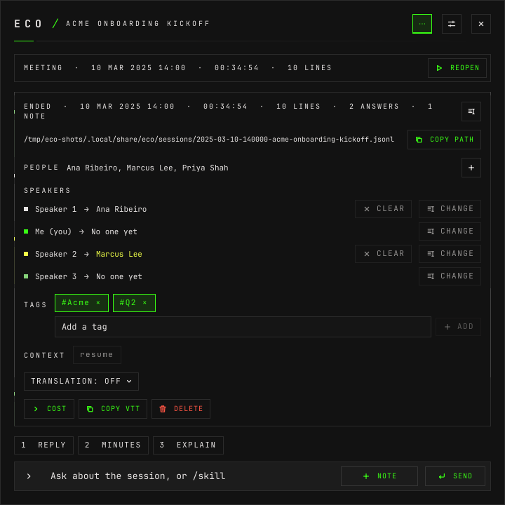

# How to ask, and how to use skills

**The question:** in the middle of a call, or a week after it, I want an answer
about what was said — a reply to suggest, the minutes, one fact. How do I ask?

This page is enough on its own. It ends with a question answered, a skill run
and a note kept, in the window and from the command line, and with what the
model was given to answer them.

---

There are three things to send from a session, and they share one line at the
bottom of it, the **composer**:

- **A question** — anything, in your words. Its answer is a card labelled
  **ASK**.
- **A skill** — a request you wrote once and run with one key: `minutes`,
  `reply`, `probe`. Its card carries the skill's name.
  [How to write skills](how-to-write-skills.md) is where they come from.
- **A note** — a fact you type during the conversation. It asks nothing; every
  later answer reads it.

A live session and a stored one take all three the same way. The config, the
socket and the command line call a skill an **action**.

## Before you start

- **A session, live or stored.** [How to record a session](how-to-record-a-session.md).
- **A chat model.** [How to register models](how-to-register-models.md).

---

## 1. Ask a question

Type in **Ask about the session, or /skill** and press Enter, or **SEND**.


The card shows the question asked, and then the answer as it arrives. Until the
first word it counts the seconds — `WAITING FOR THE MODEL · 3 S` — and, if the
model reasons first, shows `THINKING` with its reasoning, which is never kept.
Hovering the card's heading shows how long the first word took and how much of
the prompt the provider had cached.


## 2. Run a skill

Three ways, all the same request:

- **A chip** above the composer. The chips are numbered, and **Alt+1** to
  **Alt+9** run them even when a short window hides the chips.
- **`/` in the composer.** It lists the skills, filtered as you type: ↑ and ↓
  choose, Tab completes, Enter runs.
- **A Hyprland key**, from anywhere, without looking at eco. It runs on the
  session the window showed last. [How to write skills](how-to-write-skills.md#5-give-it-a-key)
  binds one.


**One answer at a time per session.** A request made while that session is
still answering waits for it, and is sent with that answer in its context; a
newer one replaces the one waiting. Different sessions answer side by side.

## 3. Keep a note

Type the fact and press **NOTE**, or Shift+Enter. It stays in the timeline as a
**NOTE** card, and every later question and skill reads it as
`Nota do usuário: …` among the lines heard. It is how you tell the model what
nobody said out loud: "the pilot customers are Acme and Brightline".

## 4. Use the answer

The heading of a finished card has three buttons:

- **Copy** — the answer's Markdown, to the clipboard.
- **Translate** — the answer, below it, into the session's translation language,
  or the interface's when the session translates nothing.
- **Remove** — it leaves the screen **and** the context of every later request.
  A removed answer is not read again by the model.

A skill with a hook also has a send button, for the answer to go to another
program; the card then says SENT, or NOT SENT in red as in the picture in
step 1 — [how to write skills](how-to-write-skills.md#6-send-the-answer-somewhere).

---

## From the command line

The same three, on any session by its id (`eco sessions` lists them;
`c7fe3528d507` below is a placeholder). Each waits for the whole answer and
prints one JSON object; the answer is kept in the session, where the window
shows it.

```bash
eco ask c7fe3528d507 what did we decide about the release date?
```

```
{"ok":true,"data":{"session":"c7fe3528d507","id":"f32511ce","action":"chat","prompt":"what did we decide about the release date?","model":"openai/gpt-6-luna","text":"We decided to release it to pilot customers on Tuesday, after fixing the migration issue.","ttft_ms":1162,"total_ms":1362}}
```

`action` is `chat` for a free question.

```bash
eco note c7fe3528d507 The pilot customers are Acme and Brightline.
```

```
{"ok":true,"data":{"session":"c7fe3528d507","id":"798c8b52","text":"The pilot customers are Acme and Brightline.","at":1791500033.9254189}}
```

```bash
eco action c7fe3528d507 minutes
```

```
{"ok":true,"data":{"session":"c7fe3528d507","id":"3e7a3afa","action":"minutes","prompt":"minutes","model":"openai/gpt-6-luna","text":"**Decisions**\n- Release the export tool to the pilot customers—Acme and Brightline—on Tuesday, after the migration fix.\n\n**Owners**\n- Marina: Fix the migration script for accounts with no email before Tuesday.\n- Leo: Tell Acme and Brightline about the Tuesday release.","ttft_ms":1470,"total_ms":1953}}
```

Nobody said the customers' names; the note did. `text` is Markdown. An agent
does the same through the `eco` skill —
[how to use eco from an agent](how-to-use-eco-from-an-agent.md).

---

## What the model is given

Every request is one conversation, built so the provider can reuse its start:

1. **The rules** for every answer — **Settings › Answers** edits them. A skill's
   own prompt and format override them.
2. **Your context**: the global context files, always sent, and the **context
   slots** this session has on, each under its name.
3. **The session**: its kind, its title, the lines heard and the notes kept,
   and the earlier answers that were not removed, as far back as
   `max_context_chars` reaches.
4. **The request**: your question, or the skill's prompt and format.

A **context slot** is a name and some files — a résumé for interviews, a
project's notes for its meetings. A kind can start with slots on; in a session,
the **CONTEXT** line of its details turns them on and off:



From the command line:

```bash
eco context c7fe3528d507                    # the slots on, and the ones available
eco context c7fe3528d507 --add resume       # turn one on
eco context c7fe3528d507 --remove resume    # and off
```

Context files are read when the daemon builds its setup: an edit to one counts
once the settings are saved or the daemon restarts.

**A second model can check every answer.** With the reviewer on
(**Settings › Answers**), each answer is first drafted unseen, and a second model
rewrites it, cutting what the transcript, the notes and the context do not
support. Only the rewrite shows and is kept. It costs a few seconds per answer.

---

## What can go wrong

**`/word` that is not a skill.** It is not sent as a question; the line keeps the
text and says `No skill /word: fix the name, or drop the slash to ask it`. A `/`
followed by more words, or a path such as `/etc/hosts`, is asked as written.

**The skill does not exist** — from the command line:

```
{"ok":false,"code":"action.unknown","message":"unknown action \"minutes\""}
```

**The model failed.** The card stays, in red, with `No answer: <why>` (the ASK
card in the picture in step 1). From the command line the code is `completion.failed`, with the same reason.

**A newer request replaced this one** while it waited: `suggestion.removed`.

**The daemon is not running:** `daemon.offline`. `eco start`.

---

## Next

- [How to write skills](how-to-write-skills.md) — your own requests, their
  model, their key and their hook.
- [How to find a session](how-to-find-a-session.md) — to ask about last week's.
- [`design.md` §6](design.md#6-answers) — answers, the prompt and the cache, in
  full.
