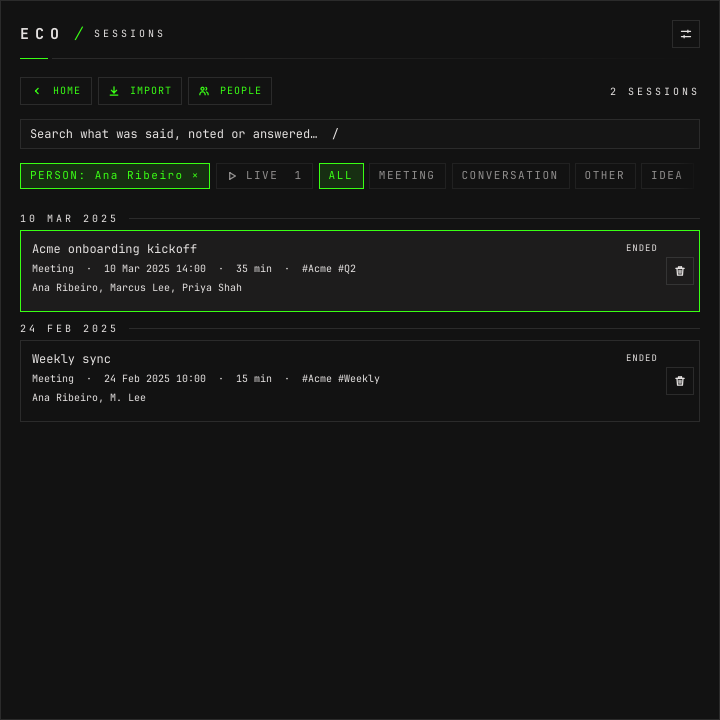
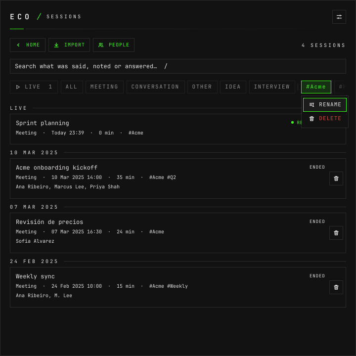
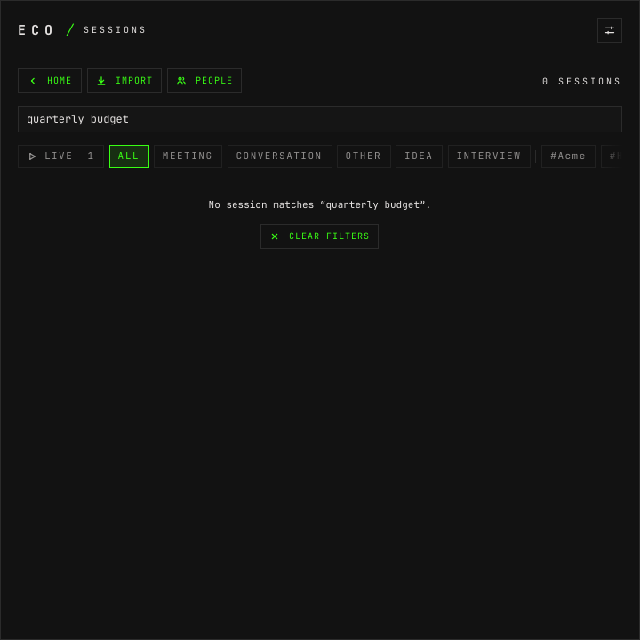

# How to find a session

**The question:** somebody said something about the VPN in a meeting with Acme a
few weeks ago. Which session was it — and how do I keep the Acme ones together
from now on?

This page is enough on its own. It covers the search, the filters, the live
sessions and the tags that group sessions.

---

## Before you start

- **The daemon is running.** `eco status` says
  `eco: daemon running (pid …, version …)`.
- **There are sessions.** Stored ones live in `~/.local/share/eco/sessions/`, one
  append-only log each.
- `90a8bbae6b73` is a session's id and `9bb9e6f8bd1e` a person's throughout this
  page; yours come from `eco sessions` and `eco people`. The outputs are piped
  through `jq` to keep the fields that matter; without it each command prints
  the whole list on one line.

---

## 1. Search what was said

```bash
eco sessions --search "VPN" | jq -c '.data | map({id,title,tags})'
```

```json
[{"id":"90a8bbae6b73","title":"Acme kickoff","tags":["Cliente Acme","Onboarding"]}]
```

The search reads a session's title, its tags, its lines, its notes, the
questions asked and the answers — **as they read now**: a corrected line is
found by its correction, a removed one is not found at all. It ignores case and
accents, and matches the text as one phrase, so `vpn access` finds "The VPN
access is still pending" and `access vpn` does not. The newest come first
([design.md §7.1](design.md#71-search)).

## 2. Filter the list

```bash
eco sessions --kind meeting
eco sessions --tag "cliente acme"
eco sessions --person 9bb9e6f8bd1e
```

They combine with each other and with `--search`:

```bash
eco sessions --person 9bb9e6f8bd1e --search "deadline" | jq -c '.data | map({id,title,people})'
```

```json
[{"id":"90a8bbae6b73","title":"Acme kickoff","people":["92a51b53481d","9bb9e6f8bd1e","bf6138640ec8"]}]
```

`--person` is anyone the session names: a speaker identified as them, or
someone added to it without speaking. [How to name the
speakers](how-to-name-the-speakers.md). `--tag` ignores case.

Each session in the list carries, among other fields, `id`, `title`, `kind`, `source`, `language`,
`state`, `started_at`, `duration_s`, `speech`, `suggestions`, `speakers`,
`people`, `tags`, `translating` and `cost`.

## 3. The ones recording now

Several sessions can record at once — a call and a class. They are the ones
whose `state` is `recording` or `paused`:

```bash
eco sessions | jq -c '.data[] | select(.state == "recording" or .state == "paused") | {id,title,state}'
```

`interrupted` is a session a daemon left open when it stopped. It is stored, not
live, and nothing reopens it on its own.

---

## 4. Tag a session

A tag is your own grouping, apart from kinds and people. **A session has as many
as you like.**

```bash
eco tag add 90a8bbae6b73 "cliente acme"
```

```json
{"ok":true,"data":{"tags":["Cliente Acme"],"session":"90a8bbae6b73"}}
```

Written `cliente acme`, it came back `Cliente Acme`: **a tag is one whatever its
case, and keeps the casing it was first written in.** Another session already
had it. A second tag adds to the list:

```bash
eco tag add 90a8bbae6b73 "Onboarding"
```

```json
{"ok":true,"data":{"tags":["Cliente Acme","Onboarding"],"session":"90a8bbae6b73"}}
```

Every tag, with how many sessions carry it:

```bash
eco tag list
```

```json
{"ok":true,"data":[{"tag":"Cliente Acme","sessions":3},{"tag":"job","sessions":2},{"tag":"Onboarding","sessions":1}]}
```

## 5. Rename, take off, delete

```bash
eco tag rename "Onboarding" "Kickoff"
```

```json
{"ok":true,"data":{"sessions":["90a8bbae6b73"],"from":"Onboarding","to":"Kickoff"}}
```

It renames the tag in every session that carries it, and lists them. Renaming
into a tag that already exists joins the two under the new spelling.

`tag remove` takes a tag off one session, and `tag delete` off every session:

```bash
eco tag remove 90a8bbae6b73 "kickoff"
```

```json
{"ok":true,"data":{"tags":["Cliente Acme"],"session":"90a8bbae6b73"}}
```

That was the only session tagged `Kickoff`, so the tag is gone, and deleting it
now finds nothing; an empty tag is refused too:

```bash
eco tag delete "Kickoff"
eco tag add 90a8bbae6b73 "  "
```

```json
{"ok":false,"code":"tag.not_found","message":"no session is tagged \"Kickoff\""}
{"ok":false,"code":"tag.invalid","message":"a tag needs a name"}
```

Each change appends a `tags` record with the session's whole list to its log, so
the history stays in the file ([design.md §7.5](design.md#75-tags)).

---

## In the window

**SESSIONS** from the start screen (`h`). The live sessions come first under
LIVE, with a dot before their state, then the others newest first under their
day:


Each row says the title, kind, tags, when, how long, who, and the state. It
never says what the session cost: that is inside the session.

**The search** is the field at the top; `/` goes to it from anywhere in the
list, and `↑` on the first row goes back to it:


**The chips** filter: LIVE, the kinds (when there is more than one), and the
tags, on one line that scrolls sideways. Selecting someone on the People screen
adds their chip first, `PERSON: Ana Ribeiro ×`; its `×` drops it:



**LIVE is the one place live sessions show.** Not on the start screen and not in
another session's chat: a window that leaves a live session to go here finds it
under LIVE. With LIVE on, the line above the list says what is transcribing — the
model and language of each transcriber running, and `×n` when one feeds several
sessions — so a second paid model never runs unseen:


A tag's chip renames or deletes the tag in every session: right click, the menu
key, F2 or Delete. Deleting asks first, saying how many sessions lose it:




A session's own tags are in its details (`⋯`): **TAGS** lists them as chips,
whose `×` takes one off, and the field under them adds one, offering the
existing tags as you type. The start dialog takes tags too, so a session can be
tagged before it says a word.

When nothing matches, the list says why and offers to clear what is hiding it:



---

## Next

- [How to name the speakers](how-to-name-the-speakers.md) — what `--person`
  filters on.
- [How to import a recording](how-to-import-a-recording.md) — sessions recorded
  without eco.
- [How to use eco from an agent](how-to-use-eco-from-an-agent.md) — the same
  search, asked by an agent.
- [Every screen the window draws](screens.md).
- [The command line](cli.md) — `sessions`, `tag`.
