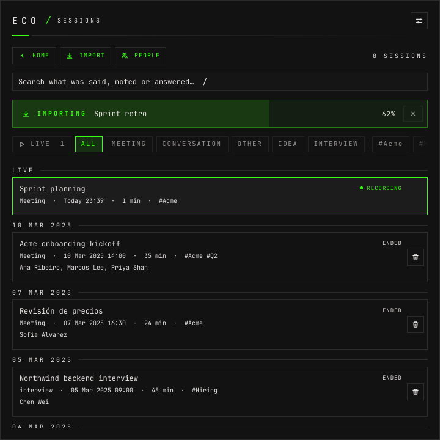

# How to import a recording

**The question:** the call happened without eco — a Teams transcript, a Zoom
recording, a talk on video. How do I make it a session I can search, ask about
and name the speakers of?

This page is enough on its own. It ends with the file as a session like any
other: lines, speakers, answers and tags.

---

## Before you start

- **The daemon is running.** `eco status` says
  `eco: daemon running (pid …, version …)`.
- **`ffmpeg` and `ffprobe` are installed**, for anything that is not a
  transcript. They decode the file; eco never writes its audio to disk.
- **A transcription model is registered**, for audio and video. The file is
  transcribed by the model of the kind you give it. [How to register
  models](how-to-register-models.md).
- **For speakers told apart by voice, `eco setup` has run.** It downloads the
  speaker model. Without it every line stays with one audio source.
- `/home/you` in the outputs below stands for your home directory.

Two kinds of file, and they go two different ways:

| file | what eco does |
|---|---|
| a WebVTT transcript (`.vtt`, recognised by its `WEBVTT` header) — Teams, Zoom, or `eco export` | one line per cue, speakers and times from the file. **Nothing is transcribed.** |
| anything ffmpeg decodes — mp4, mkv, webm, m4a, mp3, ogg, flac, wav… | decoded to 16 kHz mono through a pipe, cut by the VAD, transcribed by the STT as fast as it goes, then split by voice |

---

## 1. Import a transcript

The file here is a synthetic WebVTT with two speakers:

```
WEBVTT

00:00:01.000 --> 00:00:05.000
<v Speaker 1>Let's start with the onboarding plan for Acme.

00:00:05.500 --> 00:00:10.000
<v Speaker 2>The VPN access is still pending on their side.
…
```

```bash
eco import ~/recordings/kickoff.vtt --title "Acme kickoff" --kind meeting --language en
```

```json
{"ok":true,"data":{"session":{"id":"90a8bbae6b73","title":"Acme kickoff","kind":"meeting","source":"import","language":"en","state":"importing","started_at":1791499970.3514547},"total_s":18.0,"complete":true}}
```

The `state` is the one the session started in; it waits for the end before
printing, and `complete: true` says the whole file went in. `eco show` reads it
back as `ended`:

```bash
eco show 90a8bbae6b73
```

```json
{"ok":true,"data":{"session":{"id":"90a8bbae6b73","title":"Acme kickoff","kind":"meeting","source":"import","language":"en","state":"ended","started_at":1791499970.3514547,"duration_s":14,"speech":4,"suggestions":0,"speakers":["Speaker 1","Speaker 2"],…,"path":"/home/you/.local/share/eco/sessions/2026-10-08-195250-acme-kickoff.jsonl","bytes":777},"timeline":[{"type":"transcript","session":"90a8bbae6b73","who":"Speaker 1","name":"Speaker 1","text":"Let's start with the onboarding plan for Acme.","at":1791499971.3514547,"latency_ms":0},…]}}
```

Teams writes speakers as `<v Name>` spans and Zoom as `Name: text`; both are
read. Numeric character references (`&#233;`) are decoded. Importing what
`eco export` printed gives the same lines, speakers and starts back.

**`started_at` is when the file was last changed**, here: a transcript carries
no recording date. [The date](#3-the-date) says how to give the right one.

## 2. Import audio or video

```bash
eco import ~/recordings/rust-talk.mp4 --kind other --title "Rust talk" --language en
```

It waits until the whole file is transcribed and prints the same object. To get
the prompt back at once, add `--no-wait`; it prints as soon as the import
starts, with the file's length in seconds. For a three-second file:

```bash
eco import ~/recordings/tone.m4a --title "Tone" --kind other --no-wait
```

```json
{"ok":true,"data":{"session":{"id":"41d2e388ed54","title":"Tone","kind":"other","source":"import","language":"pt","state":"importing","started_at":1791500058.7456229},"total_s":3.0}}
```

With no `--language` it took the default spoken language, `pt` here.

What happens meanwhile ([design.md §7.7](design.md#77-import)):

1. `ffprobe` reads the length and the recording date; `ffmpeg` decodes the
   file through a pipe.
2. The VAD keeps the speech, and the STT transcribes it — one line per phrase
   the STT times, each at its time in the recording.
3. The lines start as the audio source you gave (`--participant`; you by
   default). Beside them, a child `eco diarize` embeds the same speech.
4. When the file ends, each line goes to the voice that talks most over it:
   `Speaker 1`, `Speaker 2`… in the order they first speak. One voice found
   leaves the lines with the audio source.

The voices are kept, so the speakers get guesses against the people you have
named before. [How to name the speakers](how-to-name-the-speakers.md).

## 3. The date

A session starts when its recording did, not when you import it, so last
week's call sits under its own day in SESSIONS. eco takes the first of:

1. the date you give with `--date`, local time, `YYYY-MM-DDTHH:MM[:SS]` (a
   space works for the `T`);
2. the date the file says it was recorded — the `creation_time` tag phones,
   cameras and recorders write, read by `ffprobe`;
3. when the file was last changed.

A file recorded with a tag, here one made with
`ffmpeg … -metadata creation_time=2026-09-30T09:15:00Z`, starts at it:

```bash
eco import ~/recordings/tone.m4a --title "Tone"
```

```json
{"ok":true,"data":{"session":{"id":"9acac206bb03","title":"Tone","kind":"meeting","source":"import","language":"pt","state":"importing","started_at":1790759700.0},"total_s":3.0,"complete":true}}
```

`1790759700` is 30 Sep 2026 09:15 UTC — 06:15 in São Paulo, where this ran.
To give the date yourself:

```bash
eco import ~/recordings/kickoff.vtt --title "Dated" --date "2026-10-01T08:00"
```

```json
{"ok":true,"data":{"session":{"id":"b8f82e14ceb9","title":"Dated","kind":"meeting","source":"import","language":"pt","state":"importing","started_at":1790852400.0},"total_s":15.0,"complete":true}}
```

The log is named by that date too:
`~/.local/share/eco/sessions/2026-10-01-080000-dated.jsonl`. A date in another
shape is refused before anything is sent:

```
error: invalid value 'yesterday' for '--date <DATE>': "yesterday" is not YYYY-MM-DDTHH:MM[:SS]
```

## 4. The defaults

Every option can be left out:

| option | when left out |
|---|---|
| `--title` | the file's name without its extension |
| `--kind` | the first configured kind — the default one |
| `--language` | the default spoken language, `[stt] language`; it must be one of `[stt] languages` |
| `--participant` | the audio source marked as you |
| `--date` | when the file was recorded, else when it was last changed |

The kind decides the transcription model, as for a live session: its own if it
has one, else the default.

---

## In the window

**IMPORT** on the start screen or on SESSIONS (`i`), or drop the file on the
window:


**RECORDED** is `--date`: it shows when the file was recorded, as SESSIONS
will date it, and takes another date in the same shape; one it cannot read is
outlined and the import waits for it. **SPOKEN BY** is `--participant`. While it runs, a strip on the start screen
and on SESSIONS shows the progress, and its `×` stops it; what was transcribed
until then stays in the session:



From a script or a key binding, the window takes a file too: the newest window
opens the import dialog with it filled in, and the daemon opens a window first
when none is open. The path is absolute; `/home/you` is a placeholder for your
home:

```bash
eco window import /home/you/recordings/rust-talk.mp4
```

---

## What it costs

A transcript costs nothing: nothing transcribes it.

**Through Deepgram, each segment is a request.** The import sends Deepgram one
stretch of speech at a time, and each reply names the request Deepgram billed
it under. The session's log keeps every one, the session's alone, and once the
import ends — or is cancelled — eco asks Deepgram what each cost, as it does for
a live session. Only speech is sent, so the silence between segments costs
nothing. A key without the `usage:read` scope cannot read those costs; the
model's fallback price per minute then stands in, as an estimate.

**Through any other provider, the minutes are priced.** Only Deepgram tells eco
what a request cost, so the audio an import heard through another model is
priced at that model's fallback price per minute, when you set one. Without a
price, that part is left out of the total and marked unknown.
[How to read what a session cost](how-to-read-what-a-session-cost.md).

---

## What can go wrong

**One import at a time.** A second one while the first runs is refused with
`import.busy`. It runs beside live capture, though: a meeting can record while
last week's call imports.

**The file is not there, or is not audio.**

```json
{"ok":false,"code":"import.failed","message":"import: no file \"/home/you/recordings/missing.mp4\""}
```

**The daemon stopped mid-import.** The session ends at the next start, with
what was transcribed until then; the requests made until then are priced at
that start.

---

## Next

- [How to name the speakers](how-to-name-the-speakers.md) — `Speaker 1` is
  somebody.
- [How to find a session](how-to-find-a-session.md) — tags for what you
  imported.
- [How to read what a session cost](how-to-read-what-a-session-cost.md).
- [The command line](cli.md) — `import`, `export`.
