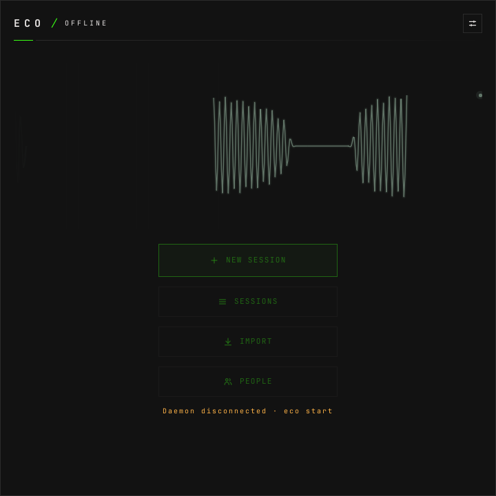

# How to install eco, and how to take it off again

**The question:** how do I get eco onto this laptop, what does it put there, and
what is left when I remove it?

This page is enough on its own. It ends with eco installed from its package,
its window open, and the one command that takes it back off. Registering models
and choosing what eco hears are their own pages; this one only gets the program
on the machine.

---

## What it needs

- **Omarchy**, or Arch with Hyprland, PipeWire and a systemd user session. eco is
  Linux only. The Hyprland config it ships is Lua (`o.bind`, `o.window`).
- **PipeWire's tools**: `pw-record` captures, `pw-dump` lists the devices.
- **Qt 6** (`qt6-base`, `qt6-declarative`), which draws the window. Omarchy
  already has it, and the package depends on it.
- **`socat`**, for the global shortcuts: they talk to the daemon's socket.
- **`ffmpeg` and `ffprobe`**, only to import audio or video files.
- **`wl-copy`**, to copy an answer or a transcript to the clipboard.
- **A key for each paid provider you use** — OpenRouter for answers, Deepgram or
  ElevenLabs for live transcription — or a model server of your own.
  [How to register models](how-to-register-models.md) is the next page.

---

## 1. Install the package

Not published as an Omarchy default yet. From the latest GitHub release:

```bash
curl -fsSL https://raw.githubusercontent.com/This-Is-NPC/eco/master/install.sh | bash
VERSION=0.1.0 bash install.sh    # a release other than the latest
```

Every GitHub release carries the Arch package and a `SHA256SUMS` beside it.
`install.sh` downloads the package, refuses it when the checksum does not match,
and installs it with `pacman -U`.

**Installing a newer release is the upgrade.** `pacman -U` replaces the last
one. A daemon that was running goes on running the old binary until
`eco restart`, which also reopens its window if it was open.

## 2. Download its models

```bash
eco setup --harnesses agents,claude-code
```

`eco setup` downloads the two models eco runs on the laptop — Silero VAD, which
finds speech, and WeSpeaker CAM++, which tells voices apart — checks each
against a pinned checksum, loads eco's Hyprland rules (step 4) and publishes the
`eco` skill for agents:

```
eco: saved /home/you/.local/share/eco/models/silero_vad.onnx
eco: saved /home/you/.local/share/eco/models/wespeaker_campplus.onnx
eco: Hyprland rules added in /home/you/.config/hypr/bindings.lua; `hyprctl reload` loads them
eco: skill /home/you/.agents/skills/eco/SKILL.md installed
eco: skill /home/you/.claude/skills/eco/SKILL.md installed
```

Run again, it downloads and changes nothing:

```
eco: /home/you/.local/share/eco/models/silero_vad.onnx is up to date
eco: /home/you/.local/share/eco/models/wespeaker_campplus.onnx is up to date
eco: Hyprland rules in /home/you/.config/hypr/bindings.lua are up to date
eco: skill /home/you/.agents/skills/eco/SKILL.md is up to date
eco: skill /home/you/.claude/skills/eco/SKILL.md is up to date
```

`/home/you` throughout this page stands for your home directory.

## 3. Write a first config

The daemon refuses to start without `~/.config/eco/config.toml`:

```
eco: no config at /home/you/.config/eco/config.toml; see docs/design.md §9
```

The smallest config that starts names one transcription model, one chat model,
and who is heard:

```toml
[stt]
model = "deepgram"
language = "en"

[llm]
model = "gemini"

[[models]]
name = "deepgram"
type = "transcription"
base_url = "wss://api.deepgram.com/v1/listen"
model = "nova-3"
api_key_env = "DEEPGRAM_API_KEY"

[[models]]
name = "gemini"
type = "chat"
base_url = "https://openrouter.ai/api/v1"
model = "google/gemini-3.5-flash-lite"
api_key_env = "OPENROUTER_API_KEY"

[[participants]]
name = "Me"
user = true
devices = ["@default-input"]

[[participants]]
name = "Them"
devices = ["@default-output"]
```

From then on the settings window edits it for you, so this is the only time the
file has to be written by hand. Every field is in
[`design.md` §9](design.md#9-configuration). A model whose key is missing does
not stop the daemon: everything else works, and what uses that model says why.

## 4. Load the Hyprland rules

The package carries eco's Hyprland rules and keys as one Lua file,
`/usr/share/eco/hypr/eco.lua`. **`eco setup` (step 2) already did this step:**
it added one line to the end of `~/.config/hypr/bindings.lua`
(`$XDG_CONFIG_HOME/hypr/bindings.lua` when that is set) that loads it:

```lua
do local eco = "/usr/share/eco/hypr/eco.lua"; local file = io.open(eco, "r"); if file then file:close(); dofile(eco) end end -- eco setup
```

The line loads the file only while it exists, so Hyprland does not fail on it
once the package is removed. Run `hyprctl reload` to load the rules now.

`eco setup` writes nothing else in your Hyprland config, and it writes this line
only once. Before it changes the file it keeps a copy beside it,
`bindings.lua.bak.<seconds>` (the Unix time, a placeholder here), as Omarchy's
own tools do. A `bindings.lua` it cannot read or write is a warning: the rest of
setup still runs, and it exits with status 1. It leaves the file alone in two
cases, and says so:

- **A line already names an `eco.lua`** — your own `dofile`, say:

  ```
  eco: /home/you/.config/hypr/bindings.lua already loads an eco.lua; left as is
  ```

- **There is no `bindings.lua`**, as in a Hyprland config that is not
  Omarchy's. It does not create one; it prints the line, and you put it in the
  Lua file your config loads:

  ```
  eco: no /home/you/.config/hypr/bindings.lua; add this line to your Hyprland config to load eco's rules: do local eco = …
  ```

**To stop loading the rules,** put `--` in front of the line, which makes it a
comment. A commented line names an `eco.lua`, so `eco setup` leaves it as it is
from then on. Deleting the line works too, until the next `eco setup` adds it
back.

Without the rules Hyprland tiles the window like any other. With it, the window floats,
is pinned to every workspace and keeps the size you give it, and the settings
window opens centred above it. It also binds the global keys:

| keys | what |
|---|---|
| `SUPER+ALT+N` | new session |
| `SUPER+ALT+P` | pause or resume the session shown |
| `SUPER+ALT+H` | the sessions list |
| `SUPER+ALT+C` | open or close the settings |
| `SUPER+ALT+E` | bring eco to the front |
| `SUPER+ALT+1`, `SUPER+ALT+2` | run the skills named `ask` and `probe` |

The keys send one line to the socket through `socat`; none of them starts a
second daemon. The last row only works if you have skills by those names —
[how to write skills](how-to-write-skills.md) binds your own.

## 5. Start it

```bash
eco start
```

```
eco: window opened
```

Or open **eco** from the launcher, which runs the same command. `eco start`
starts the user service when nothing answers on the socket, waits for the
daemon, and asks it for a window. Each `eco start` opens one more window.


The trace moving is the check that capture works. Outside a session that is all
eco does with the audio: it measures it, and transcribes and keeps nothing.

The rest of the daemon's verbs:

```bash
eco start --headless   # the daemon only, no window: "eco: daemon running"
eco stop               # "eco: daemon stopped"
eco restart            # stop, start, and reopen the window if it was open
eco status
```

```
eco: daemon running (pid 434054, version 0.1.0)
```

`eco status` prints `eco: daemon stopped` and exits 3 when nothing answers, so a
script can test it.

**The service is not enabled.** The package carries the unit, and nothing more:
the daemon is not running after a login until `eco start` or the launcher
starts it. A crash restarts it (`Restart=on-failure`).

---

## What the install puts on the machine

The package owns these; `pacman -Ql eco` lists every file and where it is:

- the `eco` binary;
- its window, the QML the daemon launches;
- the Hyprland rules and keys, `eco.lua`;
- the launcher and its icon;
- the licence;
- the user service, which runs `eco daemon --headless`.

`eco setup` (step 2) writes these in your home, and they are not the package's:

| what | where |
|---|---|
| the VAD and speaker models | `~/.local/share/eco/models/` |
| the agent skill | `~/.agents/skills/eco/SKILL.md` and `~/.claude/skills/eco/SKILL.md` |
| the line loading the Hyprland rules | the end of `~/.config/hypr/bindings.lua` |

And what eco writes as it is used, which is yours and not the install's:

| what | where |
|---|---|
| the config | `~/.config/eco/config.toml` |
| the sessions, one append-only log each | `~/.local/share/eco/sessions/` |
| the people you named, and their voices | `~/.local/share/eco/people/` |

**No audio is ever written.** A session's log is text: lines, notes, answers.
Voices are kept as numbers that describe them, not as sound.
[`design.md` §8](design.md#8-state-on-disk) lists every file.

The skill is how an agent learns the `eco` command line. `eco setup` refreshes
the copies it owns and never overwrites a file at those paths that it did not
write.

---

## Taking it off

```bash
eco stop
sudo pacman -R eco
```

`eco stop` ends the daemon; `pacman -R` then removes everything the package
put on the machine: the binary, the window, the Hyprland rules, the launcher,
the icon, the licence and the user service.

**The line `eco setup` added to `~/.config/hypr/bindings.lua` stays,** and
does nothing: it loads the rules only while the file exists. To remove it too,
delete the line that ends in `-- eco setup`.

**Kept on purpose:** the config, the sessions, the people, the models and the
agent skill. Removing the program is not a reason to lose a year of meetings.
To remove those too:

```bash
rm -rf ~/.config/eco ~/.local/share/eco
rm -rf ~/.agents/skills/eco ~/.claude/skills/eco
```

Keys you put in `~/.config/uwsm/env` stay there until you delete those lines.

---

## What can go wrong

**The models are missing.** The daemon will not start without them, and says
which:

```
eco: missing /home/you/.local/share/eco/models/silero_vad.onnx; run `eco setup`
```

**There is no config.** The same refusal as in step 3. Write the file, then
`eco start`.

**The config does not validate.** The daemon names the rule it broke, one line,
and does not start:

```
eco: a provider's key comes from api_key_env or api_key_omapass, not both
```

**The window says OFFLINE.** Its start screen adds `Daemon disconnected · eco
start`: nothing answers on `$XDG_RUNTIME_DIR/eco.sock`. `eco status`, then
`eco start`; the window reconnects on its own. Service failures
are in `journalctl --user -u eco.service`.



---

## Next

- [How to register models](how-to-register-models.md) — the keys, and which
  model transcribes and which answers.
- [How to set up audio sources](how-to-set-up-audio-sources.md) — who eco hears,
  and which voice is yours.
- [The command line](cli.md) — every command and flag.
