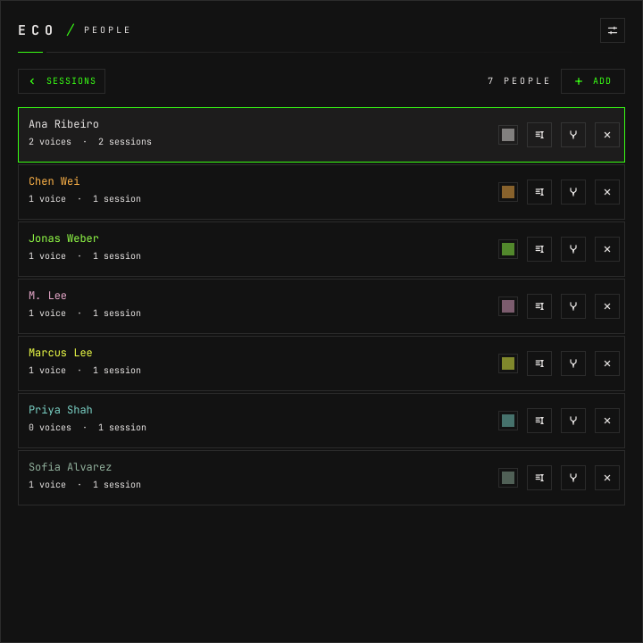
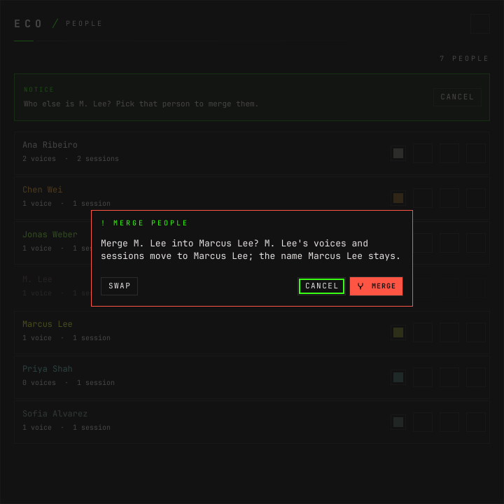
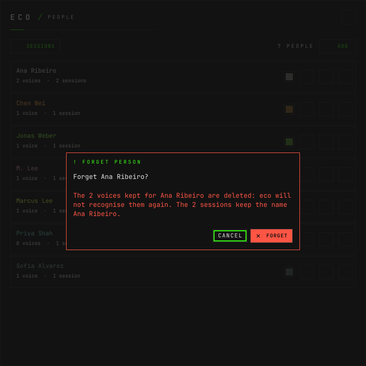

# How to name the speakers

**The question:** the session says `Speaker 1` and `Speaker 2`, and they were Ana
and Tom. How do I put their names on it — on this session, and on the next one
they speak in?

This page is enough on its own. It ends with every line under the right name,
the people kept apart from any session, and eco ready to guess them by voice
next time.

---

## Before you start

- **The daemon is running.** `eco status` says
  `eco: daemon running (pid …, version …)`.
- **There is a session with speakers in it.** An import, or a live session whose
  capture has stopped. [How to import a recording](how-to-import-a-recording.md)
  makes one in a minute.
- **For guesses by voice, `eco setup` has run.** It downloads the speaker model
  (WeSpeaker CAM++) that tells voices apart. Without it the lines keep the name
  of their audio source and there are no voices to compare.
- `90a8bbae6b73` is the session's id throughout this page, and `9bb9e6f8bd1e` a
  person's. Yours come from `eco sessions` and `eco people`.

Three words, kept apart on purpose ([design.md §7.2–§7.4](design.md#72-speakers)):

| word | what it is |
|---|---|
| **label** | what a line was heard as: the audio source (`Eu`, `Eles`), `Speaker 1`, or the name a transcript gave. It never changes. |
| **name** | what the label goes by in this session. |
| **person** | someone you named, kept in `~/.local/share/eco/people/`, with up to 16 voiceprints and every session that names them. |

---

## 1. See who the session heard

```bash
eco show 90a8bbae6b73
```

The part that matters is `speakers`:

```json
"speakers": [
  {"label":"Speaker 1","name":"Speaker 1","person":null,"color":"","voice":false,"suggestions":[],"guess":null},
  {"label":"Speaker 2","name":"Speaker 2","person":null,"color":"","voice":false,"suggestions":[],"guess":null}
]
```

`voice` says eco kept the speaker's voice. It is `false` here because this
session came from a WebVTT transcript, and a transcript has no audio. An audio
import, or the others' input of a live session, has `voice: true`, and then
`suggestions` lists the people whose voice is close, with a score.

## 2. Name a speaker

```bash
eco speaker 90a8bbae6b73 "Speaker 1" --name "Ana Ribeiro"
```

```json
{"ok":true,"data":{"session":"90a8bbae6b73","label":"Speaker 1","name":"Ana Ribeiro"}}
```

`--name` is the known person called that, in any case, or a new person when
nobody is. So the first time you name Ana she is created, and every later
session that names her joins the same person. When the speaker has a voice, the
voice joins hers too: that is what teaches eco to recognise her later.

The lines now read under her name; their label stays `Speaker 1`:

```json
{"type":"transcript","session":"90a8bbae6b73","who":"Speaker 1","name":"Ana Ribeiro","text":"Let's start with the onboarding plan for Acme.","at":1791499971.3514547,"latency_ms":0}
```

The name reaches every reading of the session: the timeline, the prompt of the
next answer, the export and the speakers of a summary.

To name someone you already have, by id, use `--person`:

```bash
eco speaker 90a8bbae6b73 "Speaker 2" --person bf6138640ec8
```

And to take a name off — the speaker goes back to their label:

```bash
eco speaker 90a8bbae6b73 "Speaker 2" --clear
```

A label the session does not have is refused, with exit code 1:

```json
{"ok":false,"code":"session.invalid","message":"session 90a8bbae6b73 has no speaker \"Speaker 9\""}
```

## 3. Fix one line that went to the wrong speaker

Diarization gives each line to the voice that said most of it, and sometimes a
short reply lands on the wrong one. A line is named by its label and its `at`,
as `eco show` lists it:

```bash
eco assign 90a8bbae6b73 line "Speaker 2" 1791499984.8514547 --person 9bb9e6f8bd1e
```

```json
{"ok":true,"data":{"session":"90a8bbae6b73","label":"Speaker 2#8cb25e72","name":"Ana Ribeiro"}}
```

Only that line changes. It gets a label of its own (`Speaker 2#8cb25e72`), so
the rest of `Speaker 2` stays who it was.

When one person said everything — a recording of yourself, say — there is the
opposite command, and it is only in the CLI:

```bash
eco assign 90a8bbae6b73 all --name "Ana Ribeiro"
```

## 4. Add someone who did not speak

A meeting has people who never said a word. They belong to the session without
being any speaker:

```bash
eco participant 90a8bbae6b73 --name "Priya Shah"
```

```json
{"ok":true,"data":["92a51b53481d","9bb9e6f8bd1e","bf6138640ec8"]}
```

The answer is every person the session now names: the ones added and the
speakers identified. `--remove <person>` takes an added one off again. That
same union is what `eco sessions --person` filters on
([how to find a session](how-to-find-a-session.md)).

## 5. Confirm what eco guessed

**eco never names a speaker on its own.** When a speaker's voice scores 0.70 or
more against someone you named before, the speaker carries a `guess`:

```json
{"label":"Speaker 2","name":"Speaker 2","person":null,"color":"","voice":true,"suggestions":[{"person":"…","name":"Bruno","score":0.82}],"guess":{"person":"…","name":"Bruno","score":0.82}}
```

and nothing changes until you say so. Confirm it by naming them as that person:

```bash
eco speaker <id> "Speaker 2" --person <person>
```

or drop it, and that guess is not made again for that speaker:

```bash
eco speaker <id> "Speaker 2" --clear
```

The threshold is measured, not chosen: on the AMI meetings the closest wrong
person scored 0.52 ([design.md §7.3](design.md#73-voices),
[benchmarks.md](benchmarks.md)). People from 0.40 up are still offered as
suggestions when you name a speaker by hand.

---

## In the window

Who is who has one place: the **SPEAKERS** list in the session's details (the
`⋯` button in its masthead). Each label shows the person it is, eco's guess, or
the name it goes by:


**CHANGE**, or clicking a speaker's name in the timeline, asks who they are:


The people the voice suggests come first, with their score, then everyone
known; or type a name. Opened from a line, **APPLY TO** also offers **THIS
LINE**. The dialog says how many lines will change, as a warning when it is
more than one. Assigning every line of a session at once is left to the CLI.
The color picker changes a known person's color in every session, or keeps a
color for this speaker alone in the session's log.

A guess shows on the speaker's lines as `JONAS WEBER?`, and as a count above
the conversation whose **REVIEW** opens the details at the speakers:


The **+** beside PEOPLE is step 4: someone in the session who is no speaker.


---

## Keeping the people tidy

Everyone you named is on the **People** screen (`p` on the start screen, or
**PEOPLE** there and in SESSIONS), with their voices and sessions:



The same, from the CLI:

```bash
eco people
```

```json
{"ok":true,"data":[{"id":"9bb9e6f8bd1e","name":"Ana Ribeiro","color":"","voices":0,"sessions":["90a8bbae6b73"]},{"id":"bf6138640ec8","name":"Tom Becker","color":"","voices":0,"sessions":["90a8bbae6b73"]}]}
```

*(Trimmed to the two people this page named; the list holds everyone, sorted
by name.)*

| to | command |
|---|---|
| keep someone before any session names them | `eco people add "Sadao Maia"` |
| rename them in every session | `eco people rename <person> "Ana Paula"` |
| say two are the same person | `eco people merge <into> <from>` |
| delete them and their voices | `eco people forget <person>` |

`people add` refuses a name somebody already has, in any case:

```json
{"ok":false,"code":"person.exists","message":"\"Tom Becker\" is already someone"}
```

Merging asks which name stays in the window, and **SWAP** turns it around:



**Forgetting cannot be undone.** It deletes the person's file and the voices
kept for them; the sessions keep the name as text, so a transcript never loses
who said what. The window asks first:



Opening a person on that screen lists their sessions —
[how to find a session](how-to-find-a-session.md).

---

## What this does not do

- **It does not recognise anyone from a transcript.** A WebVTT import has no
  audio, so no voice is kept and no guess is ever made for it. Naming its
  speakers still links them to people.
- **It does not name the user's own input by voice.** Your microphone is the
  audio source marked as you; its lines are already yours.
- **It never sends a voice anywhere.** Voices are embeddings computed on the
  laptop and kept in `~/.local/share/eco/people/`; audio itself is never
  written to disk.

---

## Next

- [How to find a session](how-to-find-a-session.md) — by person, once the
  people are named.
- [How to import a recording](how-to-import-a-recording.md) — where most
  `Speaker N` labels come from.
- [Every screen the window draws](screens.md).
- [The command line](cli.md) — `speaker`, `assign`, `participant`, `people`.
