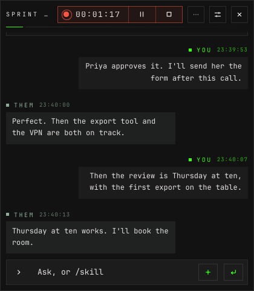
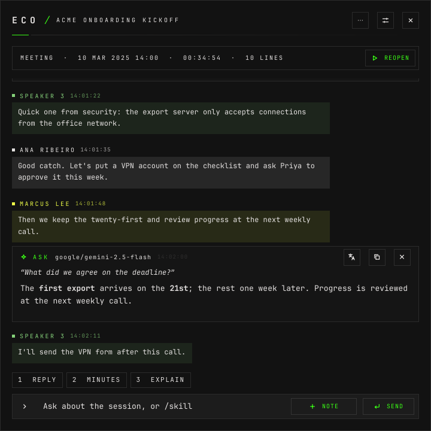
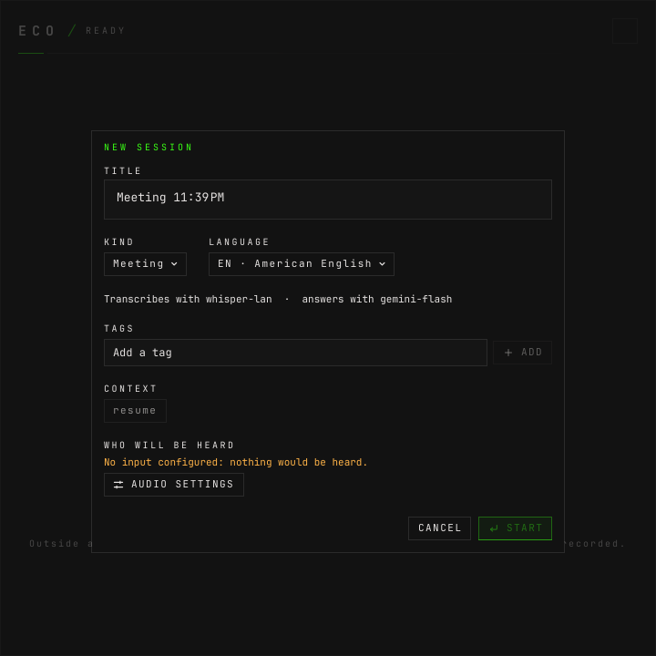

# How to record a session

**The question:** a call is about to start. How do I get eco to transcribe it,
pause it while I step out, and keep it when it ends?

This page is enough on its own. It ends with a session ended and stored, its
log on disk, and the way to pick it up again.

---

A **session** is everything eco hears between NEW SESSION and END: a title, a
kind (`meeting`, `conversation`, `other`, `idea`, or your own), a language, and a
timeline of lines, notes and answers. Outside a session eco only measures the
inputs; nothing is transcribed or kept. Inside one, the lines are kept as text.
**The audio itself is never written to disk.**

## Before you start

- **eco is running, with its window open.** `eco start`, or the launcher.
  [How to install it](how-to-install-and-remove.md).
- **At least one audio source.** [How to set up audio sources](how-to-set-up-audio-sources.md).
- **A transcription model and a chat model.** [How to register models](how-to-register-models.md).

---

## 1. Open a new session

**NEW SESSION** on the start screen, `N` there, or `SUPER+ALT+N` from anywhere.


- **TITLE** — optional. Left empty, the session is called by its kind and the
  time the dialog opened: `Meeting 14:05`.
- **KIND** — what it is. The line under it says which models a session of that
  kind transcribes and answers with.
- **LANGUAGE** — what will be spoken, from the languages offered in
  **Settings › Transcription**. `AUTO` leaves it to the transcriber.
- **TAGS** — optional, several. The tags you already use are offered as you
  type.
- **CONTEXT** — the context slots this session starts with; those of its kind
  are already on. [How to ask and use skills](how-to-ask-and-use-skills.md#what-the-model-is-given)
  says what they are.
- **WHO WILL BE HEARD** — the audio sources and their devices.

The dialog remembers the kind and language of the last session started in this
window.

## 2. Start

**START**, or Enter in any field. The window turns into the session:


- **The capsule** is the session's state: the time it has recorded (it stops
  while paused), a red dot sending out a ring while it records, the trace of
  every input, **PAUSE** and **END**. An input that sends no audio while
  recording gets a warning here.
- **The conversation** follows the newest line. Your lines are on the right;
  everybody else's are on the left, in a box tinted with their colour. With a
  streaming transcriber the words still being said show dimmed below the last
  line until the phrase ends.
- **The language picker** at the top changes the language this session is
  transcribed in, mid-call.
- **The composer** at the bottom asks, runs skills and keeps notes —
  [how to ask and use skills](how-to-ask-and-use-skills.md).

A narrow or short window keeps the same session, with the capsule folded into
the top line:



## 3. Pause, and resume

**PAUSE** in the capsule, a click on the state, or `SUPER+ALT+P`. Pausing stops
this session's transcription and its clock; the session stays open, and you can
still ask about what was said. **RESUME** picks it up.


`SUPER+ALT+P` is one line sent to the daemon's socket. The same works from a
terminal or a script of your own:

```bash
echo session.toggle | socat - UNIX-CONNECT:$XDG_RUNTIME_DIR/eco.sock
```

It pauses or resumes the session the window showed last.

## 4. Leave it running

The **×** at the top right goes back to SESSIONS; a live session keeps
recording. Its **LIVE** filter is the one place live sessions are listed:


**TRANSCRIBING** says which transcriber runs, in which language, and for how many
sessions, so a second paid model never runs unseen. Selecting the row brings the
session back.

**Several at once.** A second session can start while the first records — a call
and a class, an interview in two languages. Each holds only what was said while
it recorded. Sessions with the same model and language share one transcriber.

## 5. End it

**END** in the capsule fills red and asks `END?`, as in the picture in step 3;
press it again within three seconds. The session is stored, and the window shows the session it showed before, or the start screen.

Read it back:

```bash
eco sessions                                  # every session, newest first
eco show dea44e92fd25 | jq '.data.session | {title, kind, source, language, state, duration_s, speech, path}'
```

```
{
  "title": "Cost check",
  "kind": "meeting",
  "source": "live",
  "language": "pt",
  "state": "ended",
  "duration_s": 282,
  "speech": 1,
  "path": "/tmp/eco-hook/data/eco/sessions/2026-10-08-182901-cost-check.jsonl"
}
```

`dea44e92fd25` is a placeholder for a session id. That output came from a test
daemon whose data directory was moved; on your machine the path is
`~/.local/share/eco/sessions/<start>-<title>.jsonl`. `duration_s` is the time it
recorded: pauses do not count. The log is append-only text, one JSON object per
line.

## 6. Pick it up again

A stored session opens from SESSIONS like a live one — the conversation, its
details and the composer — with, in place of the capsule, when it was, how long,
and how much was said:



**REOPEN** (or `R`) records again into the same session, in its own language,
appending to the same log. Without reopening, it still answers questions and
runs skills about what it holds.

---

## What can go wrong

**The dialog will not start.** `No input configured: nothing would be heard.`
— there is no audio source. **AUDIO SETTINGS** opens them.



**Nothing is transcribed.** The status line says why:
`Transcription unavailable: <why>. Inputs are measured but nothing is
transcribed; fix it in Settings › Models.` — usually a key that is not set.

**An input went quiet.** The capsule shows a warning for it; its name is on the
hint, and a click opens the audio settings.

**The daemon stopped mid-session.** The session is kept as far as it got. The
next start marks it paused and shows it as **INTERRUPTED**; it is never reopened
by itself. Reopen it to go on.

**You wanted nothing kept.** A daemon started with `--no-save`
(`eco stop`, then `eco daemon --no-save`) keeps sessions in memory only.

**The others see eco in a shared screen.** By default the window is not
hidden from captures. Turn on **Settings › Interface › HIDE FROM SCREEN
SHARING**, and eco's windows show black in the share, at once and in every
window that opens later. Hyprland's `no_screen_share` cannot tell a screen
share from a screenshot, so they show black in your own screenshots and
recordings too. With it off, share a window in the call, not the whole screen.

---

## Next

- [How to ask and use skills](how-to-ask-and-use-skills.md) — answers, during
  the call or after it.
- [How to name the speakers](how-to-name-the-speakers.md) — who `Speaker 1` was.
- [How to translate a session](how-to-translate-a-session.md) — chosen per
  session, in its details.
- [The window, screen by screen](screens.md).
