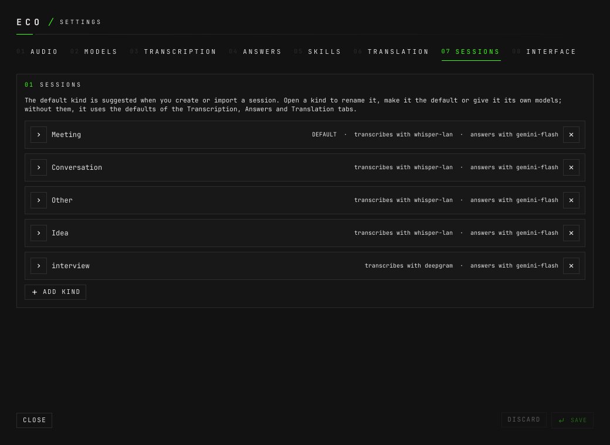

# How to register models

**The question:** eco needs one model to transcribe and one to answer. Where do
the keys go, how do I add a model, and how do I say which one does what?

This page is enough on its own. It ends with a chat model on OpenRouter and a
transcription model registered, each with its key, and an answer that proves the
chat one works. A model served from a machine on your own network is its own
page: [how to use a model on the LAN](how-to-use-a-model-on-the-lan.md).

---

A **model** is registered once, in the **Models** tab: a name of yours, a type —
**chat** or **transcription** —, the provider and the provider's id for it, and
where its key comes from. Every other tab then picks a model by that name and
never repeats a provider or a key. Answers go through one adapter, the
OpenAI-compatible API, so the provider is only a base URL: OpenRouter, Groq, or a
server of your own.

## Before you start

- **eco is installed and its window is open.**
  [How to install it](how-to-install-and-remove.md).
- **A key from each paid provider you will use.** OpenRouter
  (`openrouter.ai`) for answers; Deepgram or ElevenLabs for live transcription,
  or Groq or OpenAI for transcription phrase by phrase.
- **For Deepgram's cost, a key with the `usage:read` scope.** Deepgram tells
  what a request cost only to a key that has it. Without it eco still
  transcribes, and the cost of that audio is unknown unless the model has a
  price per minute ([how to read what a session cost](how-to-read-what-a-session-cost.md)).
- **Optional: omapass**, the Omarchy password plugin, if you would rather keep
  the keys in your keyring than in a file. eco works without it; [its plugin
  page](https://plugins.omarchy.org/plugin.html?id=io.github.this-is-npc.omapass)
  says how to install it.

---

## 1. Put the key where the daemon can read it

Only the daemon reads keys. The window never holds one, and no key is ever
written to a log. There are two places it can come from.

**From the environment.** The daemon is usually started from the launcher or a
Hyprland key, which do not read `.bashrc`, so put the keys in
`~/.config/uwsm/env`, which the whole Omarchy session reads:

```bash
export OPENROUTER_API_KEY=sk-or-…
export DEEPGRAM_API_KEY=…
```

The variables eco's presets name are `OPENROUTER_API_KEY`, `DEEPGRAM_API_KEY`,
`ELEVEN_LABS_API_KEY`, `GROQ_API_KEY` and `OPENAI_API_KEY`. A new value reaches
the daemon once the session has read the file again: log out and back in, then
`eco restart`.

**From omapass.** Save the key as a password in omapass, under an account name
such as `openrouter`. eco runs `omapass get -- openrouter` each time it builds
that provider — on start, and on every save of the settings — reading the secret
through a pipe. Nothing to restart, and nothing in a file. eco finds omapass on
`PATH` or where Omarchy installs the plugin.

## 2. Add a chat model

Open the settings (`SUPER+ALT+C`), then **Models** (`Ctrl+2`).


A closed card says what the model is and what uses it. **ADD MODEL** opens a new
one, its name field focused, starting from the provider and key source of the
last model of its type. Fill it top to bottom:

- **TYPE** — **CHAT**. It can change only while nothing uses the model.
- **Name** — yours, such as `gemini`. It is what every other tab shows. Renaming
  it later renames it everywhere.
- **REASONING** — how long the model thinks before it answers:
  **PROVIDER'S** (the provider decides), **OFF**, **LOW**, **MEDIUM** or
  **HIGH**. **OFF** starts the answer at once, which is what a live
  conversation wants; some models require reasoning and fail without it. It is
  sent as OpenRouter's `reasoning` field.
- **PROVIDER** — **OPENROUTER**, **GROQ**, or **CUSTOM** for any other
  OpenAI-compatible base URL.
- **MODEL** — the provider's id, such as `google/gemini-3.5-flash-lite`. Type
  it, or press **LIST** to ask the provider which models it offers and pick one;
  the list filters as you type.
- **KEY FROM** — **ENV**, with the variable's name (`OPENROUTER_API_KEY`), or
  **OMAPASS**, with **PICK A PASSWORD** listing omapass's accounts. Only their
  names are listed, never a secret. Without omapass on the machine, **OMAPASS**
  cannot be pressed and an info button beside it opens omapass's install page in
  the browser.
- **ADVANCED** — extra fields sent with every request, as a JSON object, such as
  `{"temperature": 0.2}`. A reasoning chosen above wins over one written here.

A registered chat model, open — it has no TYPE row, since it is in use:


**SAVE** (`Ctrl+S`). The status line says `settings saved`.

## 3. Add a transcription model

**ADD MODEL** again, type **TRANSCRIPTION**. The provider presets are:

| preset | how it transcribes | key |
|---|---|---|
| **DEEPGRAM** (`nova-3`) | streaming: words appear as they are said | `DEEPGRAM_API_KEY` |
| **ELEVENLABS** (`scribe_v2_realtime`) | streaming | `ELEVEN_LABS_API_KEY` |
| **GROQ** (`whisper-large-v3-turbo`) | one phrase at a time, once it ends | `GROQ_API_KEY` |
| **OPENAI** (`whisper-1`) | one phrase at a time | `OPENAI_API_KEY` |

The base URL decides how: a `wss://` URL streams, an `http(s)://` one is the
OpenAI-compatible `/v1/audio/transcriptions`. How fast each is, measured, is in
[benchmarks](benchmarks.md).

A transcription model takes one more field, **Fallback price per minute, USD**.
Leave it empty unless the provider reports no cost of its own; it only stands in
where nothing else does.

## 4. Say which model does what

Each tab picks from the registry, and owns its own choice:

| tab | picks |
|---|---|
| **Transcription** | the default transcription model |
| **Answers** | the default assistant — questions, and skills that name no model — and the reviewer's model |
| **Skills** | a model per skill, or the default |
| **Translation** | the model that writes translations, or the assistant's |
| **Sessions** | per kind of session, its own transcription, assistant and translation models |




**A kind can run on its own models.** Open a kind in **Sessions** to give it a
transcription, assistant and translation model of its own — an `idea` session on
a free model, an interview on the best one. A skill that names a model answers
with it in every kind.

**No fallback.** If a model is down, what uses it says so; eco never quietly
answers with another one.

## 5. Check it

Ask any session a question from a terminal:

```bash
eco ask c7fe3528d507 who tells the pilot customers?
```

```
{"ok":true,"data":{"session":"c7fe3528d507","id":"1e903aa0","action":"chat","prompt":"who tells the pilot customers?","model":"google/gemini-3.5-flash-lite","text":"Leo.","ttft_ms":1538,"total_ms":1627}}
```

`c7fe3528d507` is a session id, a placeholder here: `eco sessions` lists yours.
`model` is the provider's id of the model that answered, and `ttft_ms` how long
the first word took.

---

## In the config file

What the settings window writes to `~/.config/eco/config.toml` for the steps
above:

```toml
[stt]
model = "deepgram"                     # the default transcription model

[llm]
model = "gemini"                       # the default assistant

[[models]]
name = "gemini"
type = "chat"
base_url = "https://openrouter.ai/api/v1"
model = "google/gemini-3.5-flash-lite"
api_key_env = "OPENROUTER_API_KEY"     # or api_key_omapass = "openrouter", not both
reasoning = "off"

[[models]]
name = "deepgram"
type = "transcription"
base_url = "wss://api.deepgram.com/v1/listen"
model = "nova-3"
api_key_omapass = "Deepgram"
```

`kinds = ["idea"]` on a model makes it that kind's model of its type;
`extra = { … }` is ADVANCED. Every field: [`design.md` §9](design.md#9-configuration).

---

## What can go wrong

**The key is not set.** The daemon still starts, and everything that does not
use that model works. The window's status line says
`Model gemini unavailable: OPENROUTER_API_KEY is not set. Everything else works;
what uses this model fails until it is fixed in Settings › Models.` From the
command line, a skill on that model fails the same way:

```
{"ok":false,"code":"completion.failed","message":"probe: OPENROUTER_API_KEY is not set"}
```

A transcription model in the same state leaves the inputs measured and nothing
transcribed, and says `Transcription unavailable: …`.

**omapass is not installed.** **OMAPASS** says `omapass is not installed.` on
hover and cannot be pressed; the info button beside it opens the install page.
A model whose key already comes from omapass says the same under **KEY FROM**;
switch it to **ENV**, or install omapass. The daemon, building that provider,
fails with
`omapass is not installed (https://plugins.omarchy.org/plugin.html?id=io.github.this-is-npc.omapass)`.
With omapass and no passwords in it, **PICK A PASSWORD** says
`No passwords in omapass yet; add one there first.`

**Both sources for one key.** Refused, by the window and by the daemon at start:
`a provider's key comes from api_key_env or api_key_omapass, not both`.

**LIST refuses a key before the model is saved.** **LIST** reads a key only for
a saved model at its own base URL, or for a preset's variable at the preset's
URL. A new model with **CUSTOM** and a key, or with a key from **OMAPASS**, says
`no model list: save the model first; its key is read only for a saved model or
a preset (<base URL>)`, where `<base URL>` is a placeholder for the one typed.
Press **SAVE**, then **LIST** again. A custom base URL with no key lists at
once.

**A wrong model id, or a base URL without `/v1`.** The answer fails with the
provider's own error, and a hint when the base URL has no path.

**The eco window asks to approve a model you did not add here.** Another
program on the socket (an agent, a script) sent a config that adds a model or
moves a model's address or key source. Nothing is saved until you choose: the
dialog names the address and where the key comes from
([screens §12](screens.md#12-settings)). REJECT unless you asked for it.

**A model cannot be removed.** The assistant's and the default transcription
model cannot. Removing any other asks first, listing what falls back to which
model and whether the reviewer turns off.

---

## Next

- [How to record a session](how-to-record-a-session.md) — the models at work.
- [How to use a model on the LAN](how-to-use-a-model-on-the-lan.md) — a
  transcription or chat server on your own network, with no key.
- [How to read what a session cost](how-to-read-what-a-session-cost.md) — what
  the providers reported, per session.
- [`design.md` §5 and §6](design.md#5-transcription) — transcription and
  answers, in full.
