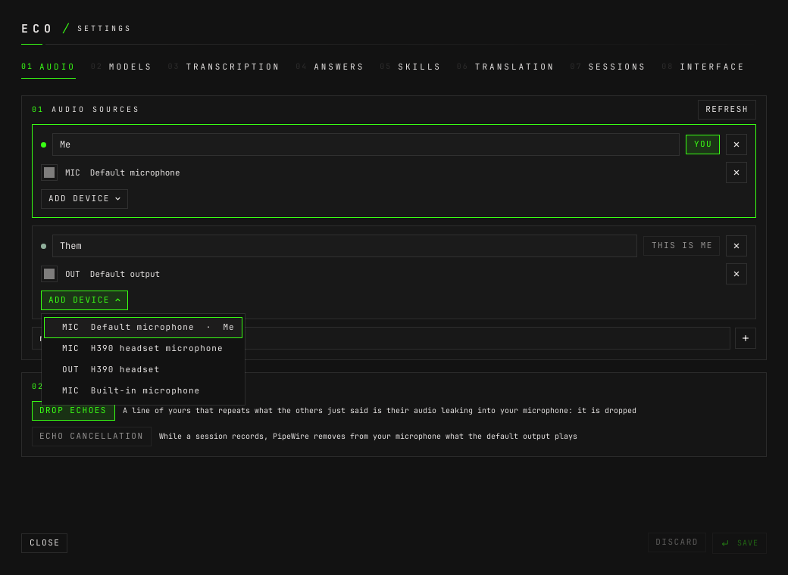
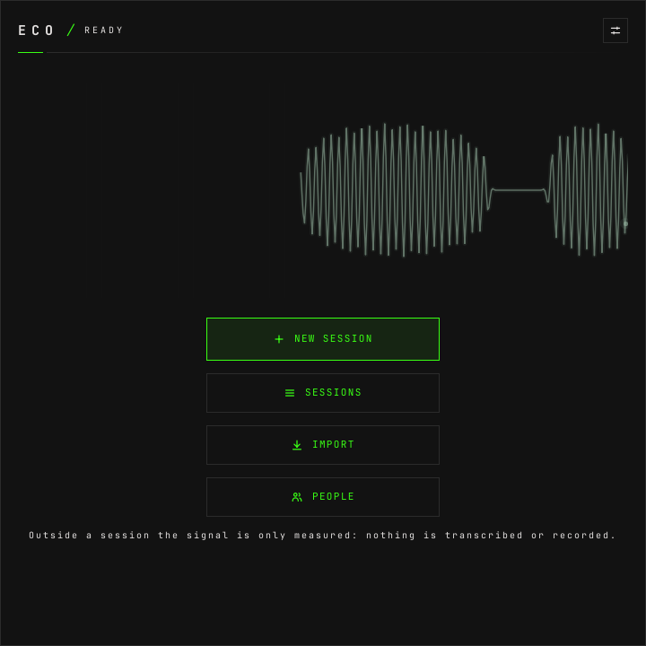

# How to set up audio sources

**The question:** eco should hear me and the people on the call, and know which
voice is mine. How do I tell it what to listen to?

This page is enough on its own. It ends with two audio sources — you, through
your microphone, and everyone else, through what the laptop plays — saved, and
their traces moving on the start screen.

---

An **audio source** is a name in the conversation — `Me`, `Them`,
`Recruiter` — holding one or more PipeWire devices. Every device is captured as
its own stream, so a line already knows whose it is when it is transcribed: your
microphone's lines are yours, without anything having to guess. In the config an
audio source is a `[[participants]]` entry.

## Before you start

- **eco is installed and its window is open.**
  [How to install it and take it off again](how-to-install-and-remove.md).
- **Headphones, if you can.** Without them your microphone also hears the call,
  and their speech comes back as yours. eco has two answers to that (step 4),
  and headphones are still the better one.

---

## 1. Open the Audio tab

`SUPER+ALT+C`, or the settings button at the top right of the window. Audio is
the first tab (`Ctrl+1`).


A first config written by hand may already have both cards. Then check them
against the steps below and skip to step 4.

## 2. Add yourself

Type a name in **new audio source, e.g. Recruiter** — `Me` — and press **+**.

On the new card, **ADD DEVICE** lists every microphone (`MIC`) and output
(`OUT`) PipeWire has, and who holds each one now. Pick **Default microphone**.
It follows whatever microphone the system uses, so plugging in a headset needs
no change here.



Picking a device another source holds moves it here: a device has one owner.

Then press **THIS IS ME**. It turns into **YOU**: your lines show on the right of
the conversation, and the model is told they are yours. Only one audio source
can be you.

## 3. Add everybody else

A second audio source, `Them`, with **Default output**. That is what the laptop
plays — the call, whatever app it is in. An output device is captured as what it
plays, not as a microphone.

**One output is usually enough.** Every voice on the call arrives through it as
one stream. When the capture stops — you pause or end the session — eco tells
the voices in that stream apart and splits its lines into `Speaker 1`,
`Speaker 2`…, which you then name.
[How to name the speakers](how-to-name-the-speakers.md) is that part.

**More than one device in a source.** A source can hold several devices, each
captured on its own and each labelled with the source's name. A device belongs
to one source only; ADD DEVICE shows who has it.

**A colour per device.** The square at the left of a device picks the colour of
its trace, everywhere a trace is drawn, so you can tell which input hears sound
by colour alone.

## 4. Choose what to do about echoes

Under **YOUR MICROPHONE**:

- **DROP ECHOES** — on by default. A line of yours whose words mostly repeat, in
  order, what the others said in the last 20 seconds is their audio leaking into
  your microphone: it is dropped, or taken back if it arrived first. Live
  sessions only.
- **ECHO CANCELLATION** — off by default. While a session records, PipeWire's
  echo canceller removes from your microphone what the **default output** plays.
  It costs about 3% of one core while recording, and only works against the
  default output.

## 5. Save

**SAVE**, or `Ctrl+S`. The status line says `settings saved`, and the daemon
restarts capture with the new sources. **CLOSE** with unsaved changes asks
whether to save them first.

Back on the start screen, each device draws its trace in its colour: flat in
silence, swinging with sound, dashed when the device sends nothing at all.



That is still only measuring. Nothing is transcribed or kept until a session
starts.

---

## In the config file

The same two sources, as the settings window writes them to
`~/.config/eco/config.toml`:

```toml
[[participants]]
name = "Me"
user = true
devices = ["@default-input"]

[[participants]]
name = "Them"
devices = ["@default-output"]

[audio]
drop_echoes = true
echo_cancel = false
```

`@default-input` and `@default-output` follow the system defaults. Any other
device is its PipeWire node name. To see them:

```bash
pw-dump | jq -r '.[] | .info.props? // empty
  | select(.["media.class"]=="Audio/Sink" or .["media.class"]=="Audio/Source")
  | "\(.["media.class"])  \(.["node.name"])"'
```

```
Audio/Sink  alsa_output.pci-0000_c1_00.1.HiFi__HDMI4__sink
Audio/Sink  alsa_output.pci-0000_c1_00.1.HiFi__HDMI3__sink
Audio/Sink  alsa_output.pci-0000_c1_00.1.HiFi__HDMI2__sink
Audio/Sink  alsa_output.pci-0000_c1_00.1.HiFi__HDMI1__sink
Audio/Sink  alsa_output.pci-0000_c1_00.6.HiFi__Speaker__sink
Audio/Source  alsa_input.pci-0000_c1_00.6.HiFi__Headset__source
Audio/Source  alsa_input.pci-0000_c1_00.6.HiFi__Mic1__source
Audio/Sink  alsa_output.usb-Logitech_G522_LIGHTSPEED_-_Wireless_Mode_0000000000000000-00.analog-stereo
Audio/Source  alsa_input.usb-Logitech_G522_LIGHTSPEED_-_Wireless_Mode_0000000000000000-00.mono-fallback
```

`Audio/Source` is a microphone, `Audio/Sink` an output. A device's trace colour is
`[colors]`, by device: `"@default-input" = "#ffb000"`. The daemon reads the file
when it starts, so a hand edit needs `eco restart`.

---

## What can go wrong

**A device is not there.** The card marks it `Unavailable device: <id>`, and the
daemon skips it rather than let `pw-record` fall back to the default device
silently. During a session the capsule shows a warning for an input that sends
no audio, and the status line says which: `Them: <device> is not connected`.

**Nobody is configured.** The new-session dialog says
`No input configured: nothing would be heard.`, offers **AUDIO SETTINGS**, and
does not start.

**Removing a source.** It asks first, and says what changes: the devices no
longer heard, `Nobody else is heard` when it held the only output, and
`No audio source is you any more` when it was you.

**Echo cancellation would not start.** The status line says
`Echo cancellation is off: <why>`, and eco records from the raw microphone.

**The config refuses a device in two sources, or two sources that are you:**
`a device can belong to one participant only`,
`only one participant can be the user`.

---

## Next

- [How to register models](how-to-register-models.md) — what transcribes what
  these sources hear.
- [How to record a session](how-to-record-a-session.md) — the first time any of
  it is kept.
- [`design.md` §4](design.md#4-audio) — capture, the VAD, echoes and live
  voices, in full.
