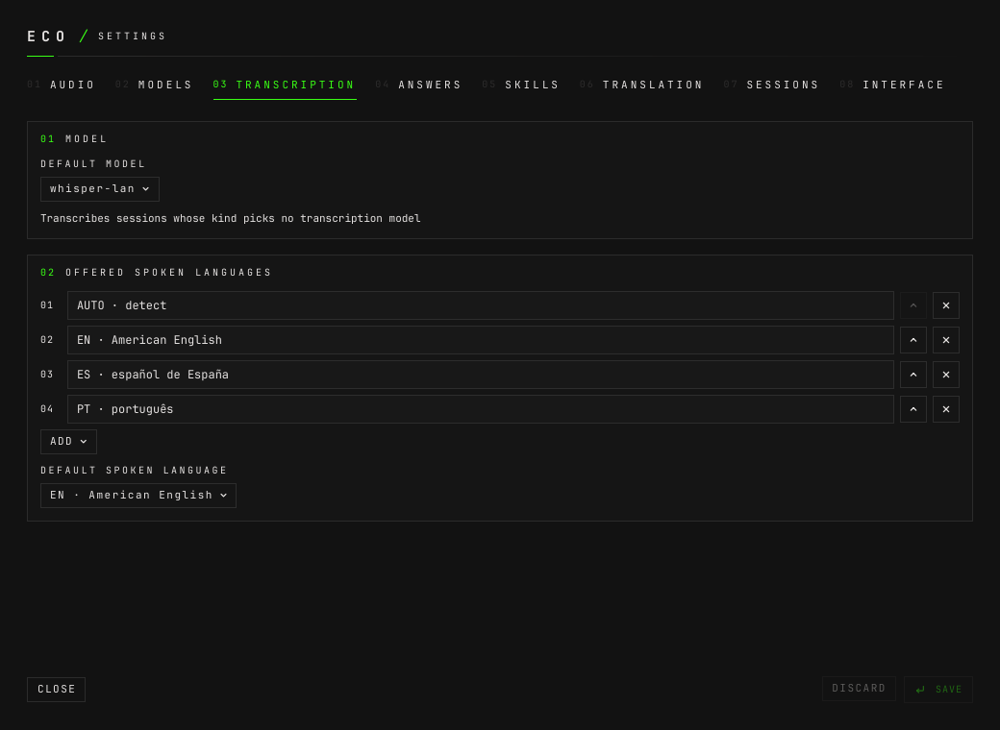

# How to use a model on the LAN

**The question:** there is a computer at home with a real GPU. Can it transcribe
— and answer — for eco, so that a session costs nothing and its audio never
leaves the house?

This page is enough on its own. It ends with a whisper.cpp server on that
computer transcribing eco's sessions, and optionally a `llama-server` beside it
answering them.

---

## Before you start

- **eco is installed on the laptop** and the daemon is running.
- **A second computer on the same network serves the models.** Here it is a
  Windows machine with a Radeon RX 9060 XT, and `192.168.0.200` is its address
  throughout this page — a placeholder for yours. It only serves models over
  HTTP: **no code from this repository runs there**, and eco reaches it through
  the same adapters as any provider.
- **On that machine:** `git`, `curl`, [mise](https://mise.jdx.dev), Visual
  Studio Build Tools 2022 (the compiler), and the Vulkan SDK from winget
  (`KhronosGroup.VulkanSDK`).

Nothing here is special to Windows on eco's side. Any machine that answers
OpenAI's `POST /v1/audio/transcriptions`, or OpenAI's chat completions, is
reached the same way.

---

## 1. Build the server

Everything lives in `C:\eco-models`, whose `mise.toml` pins `cmake` and
`ninja`. From PowerShell in that folder:

```powershell
$env:VULKAN_SDK = [Environment]::GetEnvironmentVariable("VULKAN_SDK", "Machine")
$env:Path += ";$env:VULKAN_SDK\Bin"
& "C:\Program Files (x86)\Microsoft Visual Studio\2022\BuildTools\Common7\Tools\Launch-VsDevShell.ps1" -Arch amd64 -SkipAutomaticLocation
git clone --depth 1 --branch v1.9.4 https://github.com/ggml-org/whisper.cpp
mise exec -- cmake -S whisper.cpp -B whisper.cpp/build -G Ninja -DGGML_VULKAN=ON -DCMAKE_BUILD_TYPE=Release
mise exec -- cmake --build whisper.cpp/build --target whisper-server
curl.exe -L -o ggml-large-v3-turbo.bin https://huggingface.co/ggerganov/whisper.cpp/resolve/main/ggml-large-v3-turbo.bin
```

That is `whisper-server` from whisper.cpp v1.9.4, built with Vulkan, and the
`ggml-large-v3-turbo` model.

## 2. Open the port to the LAN only

Port 8081 — 8080 is taken by the `llama-server` of step 6:

```powershell
New-NetFirewallRule -DisplayName "eco whisper-server" -Direction Inbound -Protocol TCP -LocalPort 8081 -RemoteAddress LocalSubnet -Action Allow
```

`-RemoteAddress LocalSubnet` keeps it to the LAN: the server asks for no key.

## 3. Run it

```powershell
C:\eco-models\whisper.cpp\build\bin\whisper-server.exe -m C:\eco-models\ggml-large-v3-turbo.bin --host 0.0.0.0 --port 8081 --inference-path /v1/audio/transcriptions -l auto
```

`--inference-path` puts it where OpenAI's transcription API is, so eco's
OpenAI-compatible adapter needs nothing else. `-l auto` lets each request decide
the language, since eco transcribes every session in its own language.

## 4. Register it on the laptop

In `~/.config/eco/config.toml`:

```toml
[stt]
model = "whisper-lan"     # every session, unless its kind has its own model

[[models]]
name = "whisper-lan"
type = "transcription"
base_url = "http://192.168.0.200:8081/v1"
model = "whisper-1"
```

No key: the server asks for none. **It ignores `model`**; it is sent because
OpenAI's API requires one.

An `http(s)://` base URL is what picks the OpenAI-compatible adapter
([design.md §5](design.md#5-transcription)). It is not streaming: eco's VAD cuts
the speech into segments, posts each one, keeps up to four in flight, and
keeps the lines in order. A line shows when its segment is transcribed, not
word by word.

The same in the window: **Settings › Models**, ADD MODEL, type TRANSCRIPTION,
provider **CUSTOM** with the base URL above and the key left empty:


Then **Settings › Transcription** makes it the default:



## 5. Or only for some kinds of session

The LAN server is at home; a meeting from the office is not. A kind can have its
own model instead of being the default — `kinds` on the model:

```toml
[[models]]
name = "whisper-lan"
type = "transcription"
base_url = "http://192.168.0.200:8081/v1"
model = "whisper-1"
kinds = ["idea"]          # idea sessions transcribe here; the rest keep [stt] model
```

or, in the window, open the kind in **Settings › Sessions** and pick its
transcription model:


**If that model is down, its sessions say so. Nothing falls back to another
model** — a session that should stay at home does not quietly go to the cloud.

## 6. Answers from the LAN too

The same machine runs a `llama-server` on port 8080, which speaks OpenAI's chat
API. It is a chat model like any other:

```toml
[[models]]
name = "qwen-lan"
type = "chat"
base_url = "http://192.168.0.200:8080/v1"
model = "qwen3-14b"
kinds = ["idea"]          # and answer here unless the skill names a model
```

With both, an `idea` session transcribes and answers on the LAN. A skill that
names its own model still answers with it. This page does not cover starting
`llama-server`; eco needs only its URL. `extra` carries any field the server
wants as it is.

---

## What it measured

On the RX 9060 XT, replaying a 22-second PT-BR interview question
([benchmarks.md](benchmarks.md#lan-models-2026-10-03)):

| stage | latency |
|---|---|
| whisper.cpp large-v3-turbo, per segment | ~990 ms |
| Qwen3.5-9B Q8, `ask` action | 271 ms first token, 3.4 s total |
| Qwen3.5-9B Q8, `probe` action | 356 ms first token, 7.9 s total |

**It is free, private and fast, and it is not the fastest.** End of speech to
first token is held to under 1.5 s; Deepgram's ~0.3 s leaves room for a model,
and whisper.cpp's ~1 s per segment leaves room for none. The `llama-server`
reuses the repeated start of each request: the second of two requests came 93%
from its cache, in 1.5 s instead of 3.7 s.

---

## When there is no LAN server: streaming in the cloud

For live transcription without the machine at home, **Settings › Models** offers
the **ELEVENLABS** preset when you add a transcription model: ElevenLabs Scribe
v2 Realtime, reached straight from the daemon. Put `ELEVEN_LABS_API_KEY` in the
daemon's environment, pick the preset and save. It uses
`wss://api.elevenlabs.io/v1/speech-to-text/realtime` with the model
`scribe_v2_realtime`. The session's language is chosen when it starts; `auto`
lets Scribe detect it. The English replay results are in
[benchmarks.md](benchmarks.md).

---

## What can go wrong

**The laptop is not home.** The model cannot be reached and the sessions that
use it say so; nothing else in eco stops. Give those sessions' kind another
model, or switch the default back, in Settings.

**A server that refuses `verbose_json`.** eco asks for timed segments
(`verbose_json`); whisper.cpp gives them. A server that answers 400 is asked
for plain `json` from then on, and each segment becomes one line.

---

## Next

- [How to register models](how-to-register-models.md) — every provider, keys and
  omapass.
- [How to read what a session cost](how-to-read-what-a-session-cost.md) — a
  LAN model reports no cost; a price per minute can stand in.
- [How it is built](design.md) — §5 transcription, §6 answers, §9 the
  configuration.
