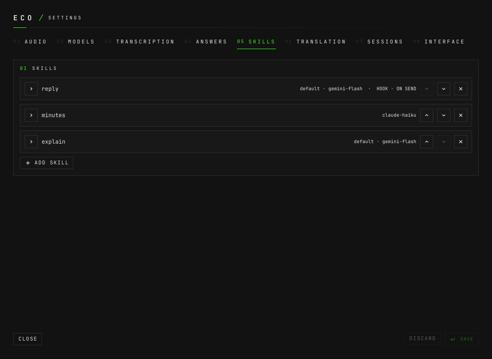
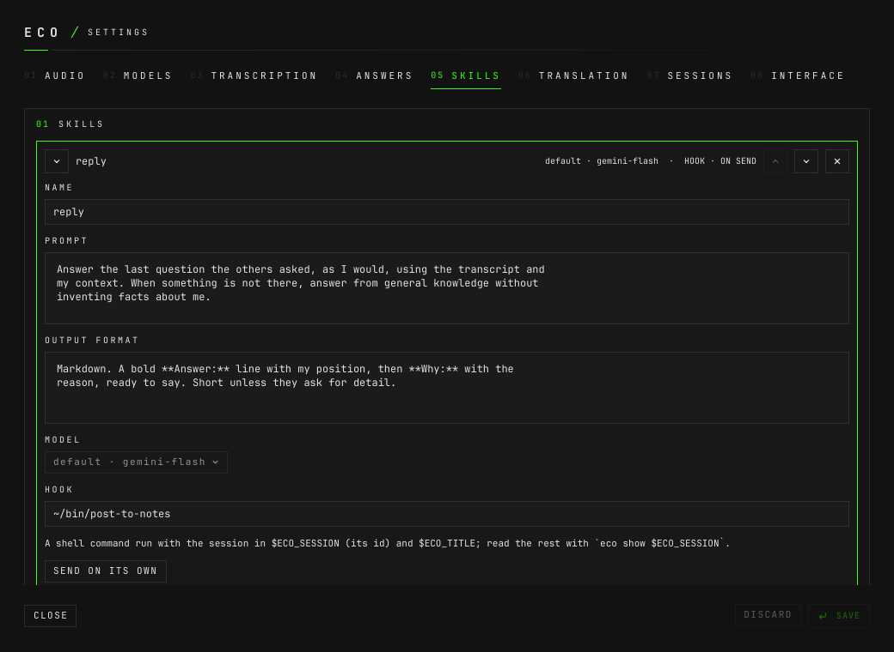
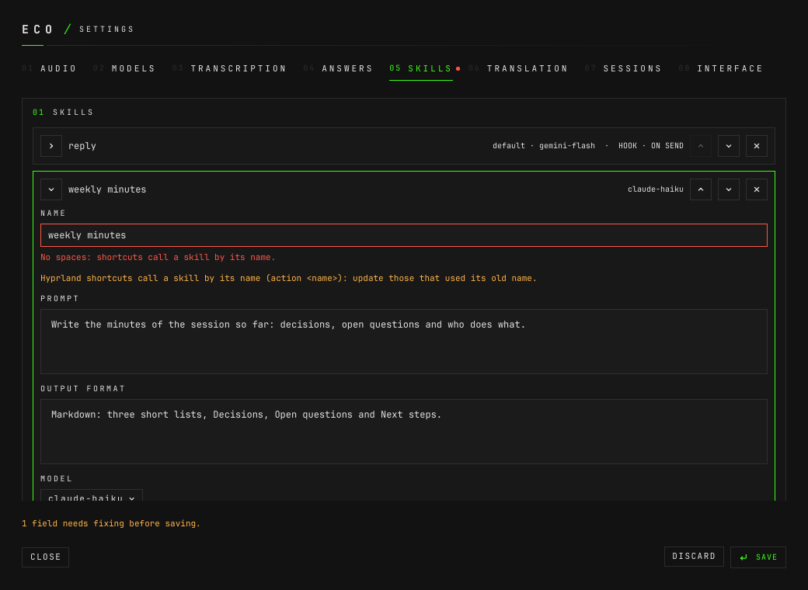
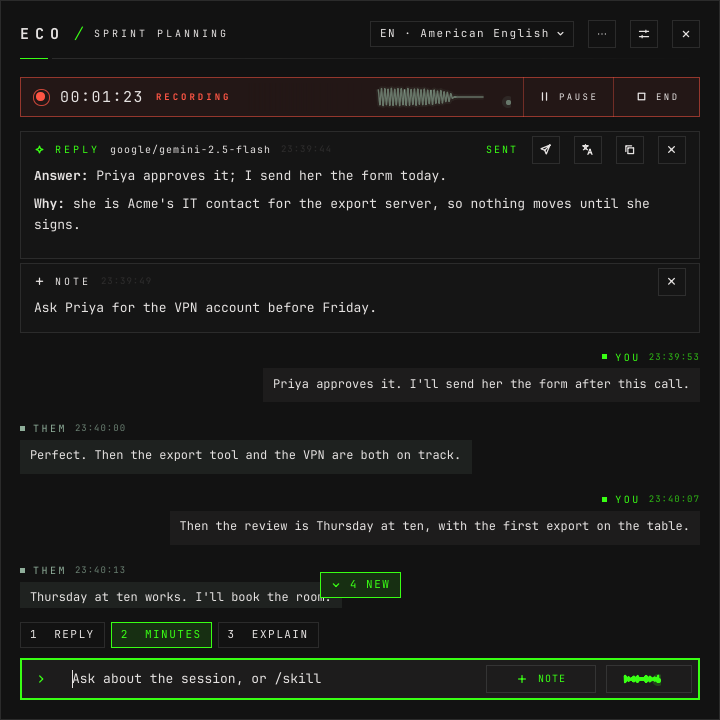

# How to write skills

**The question:** I keep asking the same thing — the minutes, a reply to
suggest, the questions to ask back. How do I write it once and run it with one
key?

This page is enough on its own. It ends with a skill of your own, on the model
you chose, run from the window, the command line and a Hyprland key, and its
answer sent to another program.

---

A **skill** is a request you write once: a name, a prompt, an output format and,
if you want, a model and a hook. It runs against a session's transcript like a
question does. The window says skill; the config, the socket and the command
line say **action** (`[[actions]]`, `action <name>`, `eco action`).

## Before you start

- **A chat model registered.** [How to register models](how-to-register-models.md).
- **A session to try it on**, live or stored.
  [How to record a session](how-to-record-a-session.md).

---

## 1. Add it

Open the settings (`SUPER+ALT+C`), then **Skills** (`Ctrl+5`).



**ADD SKILL** opens a new card, with the fields an open card has:



- **NAME** — one word, no spaces: shortcuts and `/name` call a skill by it.
  `minutes`. A space is flagged as you type it, and the draft cannot be saved:

  

- **PROMPT** — what to do.
- **OUTPUT FORMAT** — what the answer looks like.
- **MODEL** — a registered chat model, or the default, shown as
  `default · <model>`, which follows **Settings › Answers**. A skill that names a
  model answers with it in every kind of session.
- **HOOK** — optional; step 6.

**SAVE** (`Ctrl+S`). The skill is a chip in every session's composer at once.

## 2. Write the prompt and the format

Every answer follows the rules in **Settings › Answers** — the language,
brevity, never putting facts in your mouth. **A skill's prompt and format
override them**, so a skill states its own behaviour rather than you changing
the shared rules for it.

Two that work:

| name | prompt | format |
|---|---|---|
| `minutes` | Write the minutes of this session: what was decided, who does what, and by when. | Markdown: a **Decisions** list and an **Owners** list, one line per item. |
| `probe` | Suggest questions to ask back, each with why it matters. | 2 to 4 numbered items. |

The model is given the session's kind and title, its lines, its notes, the
earlier answers still in it, and your context —
[what the model is given](how-to-ask-and-use-skills.md#what-the-model-is-given).
The prompt does not have to repeat any of it.

## 3. Run it

From the composer: its chip, **Alt+** its number, or `/minutes` and Enter. From
a terminal, on a session by its id (a placeholder here; `eco sessions` lists
yours):

```bash
eco action c7fe3528d507 probe
```

```
{"ok":true,"data":{"session":"c7fe3528d507","id":"0e95e658","action":"probe","prompt":"probe","model":"google/gemini-3.5-flash-lite","text":"1. **Do we need a regression test for accounts without emails?** It matters to ensure this bug doesn't happen again in future updates.\n2. **Should we notify Acme and Brightline before or after internal testing of the fix?** It matters to manage customer expectations accurately.","ttft_ms":1059,"total_ms":1371}}
```

`model` is the one `probe` names, not the default assistant's.

## 4. Put it in order

The chevrons on a card, or **Alt+↑** and **Alt+↓** inside it, move it. The
order is the composer's: the first skill is chip 1 and **Alt+1**, up to nine.

## 5. Give it a key

A Hyprland key runs a skill from anywhere, on the session the window showed
last, without touching eco. Add a line to `~/.config/hypr/bindings.lua`, after
the `dofile` that loads eco's rules:

```lua
o.bind("SUPER + ALT + 3", "eco: minutes", "echo 'action minutes' | socat - UNIX-CONNECT:$XDG_RUNTIME_DIR/eco.sock")
```

eco's own rules already bind `SUPER+ALT+1` to `action ask` and `SUPER+ALT+2` to
`action probe`; a skill named `ask` or `probe` gets those keys for free. Keep
your own bindings in your file rather than in eco's: every upgrade of the
package replaces eco's copy.

The key reaches the running daemon through `socat`. It never starts a second
one.

## 6. Send the answer somewhere

A **hook** is a shell command eco runs after an answer, for another program to
pick it up — a CRM, a notes folder, a chat. It runs with `sh -c`, for at most 60
seconds, with only the session in its environment: `ECO_SESSION`, the session's
id, and `ECO_TITLE`. Everything else it reads with `eco show "$ECO_SESSION"`.

In the skill's card, **HOOK**:

```sh
printf "%s  %s\n" "$ECO_SESSION" "$ECO_TITLE" >> /tmp/eco-minutes.log
```

With **SEND ON ITS OWN** it runs after every answer of that skill. Without it,
the answer's card has a send button, which says `SENDING…`, then `SENT` or
`NOT SENT`:



From a terminal, with the answer's id from `eco show`:

```bash
eco send c7fe3528d507 3e7a3afa
```

```
{"ok":true,"data":{"session":"c7fe3528d507","id":"3e7a3afa","sent":true}}
```

```bash
cat /tmp/eco-minutes.log
```

```
c7fe3528d507  Pilot standup
```

---

## In the config file

The settings window writes each skill as an `[[actions]]` entry in
`~/.config/eco/config.toml`, in the composer's order:

```toml
[[actions]]
name = "minutes"
prompt = "Write the minutes of this session: what was decided, who does what, and by when."
format = "Markdown: a **Decisions** list and an **Owners** list, one line per item."
hook = 'printf "%s  %s\n" "$ECO_SESSION" "$ECO_TITLE" >> /tmp/eco-minutes.log'

[[actions]]
name = "probe"
prompt = "Suggest questions to ask back, each with why it matters."
format = "2 to 4 numbered items."
model = "gemini"                        # a registered chat model; the default when absent
```

`hook_auto = true` is SEND ON ITS OWN. The daemon reads the file when it starts,
so after editing it by hand run `eco restart`; a save from the window applies at
once.

---

## Renaming and removing

**Renaming** a skill warns that Hyprland shortcuts call it by name
(`action <name>`): update the bindings that used the old one. **Removing** one
asks first, and says that the shortcuts that run it stop working and that the
skills after it move up one place in the composer — so their **Alt+** numbers
change.

---

## What can go wrong

**The name is refused** as you type it: `No spaces: shortcuts call a skill by its
name.`, or `Another one already has this name.` A save with an empty name opens
the card and says `Give it a name.`

**The skill is not there.** A key or a command naming a skill that does not
exist — a typo, or a skill since renamed — fails, and the window's status line
says `Unknown skill: <name>`. From the command line:

```
{"ok":false,"code":"action.unknown","message":"unknown action \"minutes\""}
```

**Its model is unavailable** — a key not set:

```
{"ok":false,"code":"completion.failed","message":"probe: OPENROUTER_API_KEY is not set"}
```

**The hook failed.** The card says `NOT SENT`, and the status line gives the last
line the command wrote to stderr: `The hook failed — <that line>`. Sending an
answer whose skill has no hook:

```
{"ok":false,"code":"hook.none","message":"chat has no hook"}
```

---

## Next

- [How to ask and use skills](how-to-ask-and-use-skills.md) — questions, notes,
  and what to do with an answer.
- [How to use eco from an agent](how-to-use-eco-from-an-agent.md) — `eco action`
  and `eco send` from a script or an agent.
- [`design.md` §6](design.md#6-answers) — actions, hooks and triggers, in full.
