# The window, in the order somebody meets it

A walk through eco's window, from opening it with nothing recorded yet to
looking back at a session weeks later. **Every screen the overlay draws is
here**, including the dialogs a happy path never reaches, so that a change to
the window has somewhere to be checked against. They are in the order of use,
not sorted by QML file.

[cli.md](cli.md) is where the *commands* are; this page is where the *window*
is. Why each screen is the way it is lives in [design.md §12](design.md#12-the-overlay).
If you are looking for a task rather than a screen, start at
[the map](README.md).

---

## How this page stays true

| what | how |
|---|---|
| the pictures under `img/`, `01`–`52` | `mise run shots`: writes them from the real overlay, offscreen |
| checking they are still what the window draws | nothing does: there is no `shots:check` (see below) |
| `img/eco.gif`, the icon | not a screen: drawn by `mise run readme:gif` from `packaging/eco.omapixel` |
| the window on a real desktop, over a real call | no pictures: none were taken for this page |

`mise run shots` needs no display and no call. It builds the checkout's daemon,
starts it with `--headless --replay` in a home of its own at `/tmp/eco-shots`
(runtime, data, config, state and cache directories), copies `overlay/` there
with a test-only driver, `scripts/shots/Drive.qml`, and runs that copy under
`QT_QPA_PLATFORM=offscreen`. The driver clicks and types as somebody would and
saves each window as it is drawn. A frame is refused if the window has lost the
daemon (except `02`, which is that), if it shows an error, or if it is flat —
eight colours or fewer, which is a window that drew nothing. The user's
daemon, socket and sessions are never touched: the script refuses to run if its
socket would be the user's.

What is pinned: the clock's zone is UTC and the locale `en_US`; the interface
language is English (`[ui] language = "en-US"`); the theme falls back to the
overlay's own defaults (`#39ff14` accent on `#121212`), because the temporary
state directory holds no Omarchy theme; the API keys are placeholders that are
never sent; and the home is always `/tmp/eco-shots`, so the storage path in the
session details reads the same in every run.

What is not pinned, and why there is no `shots:check`: **the live session runs
on the clock of the run.** Its running time in the capsule, the times on its
lines, its answer and its note, and `Today 23:39` in the sessions list are when
`mise run shots` was last run, in UTC. The input traces are a synthetic hum
replayed in real time, so where a burst falls in a frame depends on when the
frame was taken; and the software renderer places text at sub-pixel positions
that differ between runs. Two runs never write the same bytes, so a check that
compared them would always fail. Which face `monospace` resolves to is
fontconfig's answer on the machine that ran it.

### The sessions in the pictures

Everything below is synthetic, from `scripts/shots/fixtures/`. No real person,
résumé, recording or key is in it.

**The config** (`fixtures/config.toml`) has five kinds — `meeting`,
`conversation`, `other`, `idea` and a custom `interview` — and four models:
`whisper-lan` (transcription, at a documentation address, `192.0.2.10`, that is
never reached), `deepgram` (transcription, used by `interview`, with a price per
minute), `gemini-flash` (chat, the assistant and the translator) and
`claude-haiku` (chat, used by the `minutes` skill). Two audio sources: **Me**,
the user, on the default microphone, and **Them** on the default output. Three
skills: `reply`, which has a hook (`~/bin/post-to-notes`, never run),
`minutes` and `explain`. One global context file,
`~/notes/about-me.md`, and one context slot, `resume`, that `interview`
sessions start with on.

**Seven stored sessions**, all ended, written straight into the sessions
directory as logs:

| session | kind | when (UTC) | what it is there for |
|---|---|---|---|
| Weekly sync | meeting | 24 Feb 2025 10:00 | `M. Lee`, the half of a duplicate person to merge; tags `#Acme #Weekly` |
| Rust meetup: async in practice | other | 27 Feb 2025 18:00 | imported; one speaker whose voice is close to Jonas Weber's — the voice guess |
| Offline mode for the field app | idea | 3 Mar 2025 19:40 | only the user speaks; `#Product` |
| Coffee with Jonas | conversation | 4 Mar 2025 11:15 | Jonas Weber's voice, which the guess above matches |
| Northwind backend interview | interview | 5 Mar 2025 09:00 | the custom kind, on `deepgram`, with the `resume` slot on; `#Hiring`; an answer whose cost was not reported, and minutes Deepgram would not price |
| Revisión de precios | meeting | 7 Mar 2025 16:30 | spoken in Spanish, translated into English |
| Acme onboarding kickoff | meeting | 10 Mar 2025 14:00 | the session most pictures open: ten lines, two answers, a note, an unnamed `Speaker 3`, a person added with no voice, and its costs |

**Seven people**: Ana Ribeiro (two voices, two sessions), Marcus Lee and
M. Lee (the same man twice), Chen Wei, Jonas Weber, Sofia Alvarez, and Priya
Shah, who is in the kickoff without a voice of her own.

**The live session** is started by the pictures themselves, in the new-session
dialog: `Sprint planning`, a meeting tagged `#Acme`. The daemon hears only
`replay.wav`, ten minutes of synthetic hum in bursts written by the script,
which goes to the first source that is not the user (**Them**). It holds no
speech, so nothing is transcribed and no model is asked anything. The lines,
the answer and the note on screen in `05` to `10` come from
`fixtures/live.json`, and the later answers in `07` and `08` — sent, not sent,
failed, thinking — from `fixtures/answers.json`. Both are handed to the window
directly; the daemon never heard them, and `eco show` on that session would not
list them.

**Also handed to the window, not done by the daemon:** the empty input list of
`04`, the import part way through in `35` (the replay has no speech for an
import to transcribe), and the three PipeWire devices in the menu of `39`
(`fixtures/devices.json`: under `--replay` the daemon lists none). The import
dialog in `34` names `~/recordings/sprint-retro.vtt` from the fixtures and is
closed without importing it. `02` is the last picture taken: the script stops
the daemon first.

---

# 1. Opening it

```bash
eco start
```

`eco start` starts the daemon's user service if nothing answers on the socket
and opens a window (`--headless` leaves it closed). Opening the app again opens
another window; each is its own Quickshell process.


The trace is every input in the room, in each input's colour. Flat is silence,
a swing is audio, and a faint dashed line is an input that sends nothing — so a
glance says capture works before a session starts. The sentence under the
buttons is literal: outside a session the audio is measured for this trace and
nothing else.

**No connection badge while things work.** Without the daemon the start
screen's masthead reads `OFFLINE`, its buttons dim, and the line under them
says `Daemon disconnected · eco start`; every other screen shows a
`DISCONNECTED` badge in its masthead. The window reconnects on its own.


| key | what it does |
|---|---|
| `N` | new session |
| `H` | SESSIONS |
| `I` | import a recording |
| `P` | people |
| `?` · `F1` | every key, in one list (section 11) |

No button shows its key; keys live only in the shortcuts list.

# 2. Starting a session

**NEW SESSION**, or `N`:


Everything is optional except the kind and the language. The title's
placeholder is the title the session gets if none is typed (the kind and the
time). The dialog starts from the kind and language this window's last session
used, and says which models that kind runs on, so a paid transcriber is never
picked unseen. Tags offer the existing ones as they are typed. The context
slots are chips: those of the chosen kind start lit — `resume` is off here
because it belongs to `interview`. WHO WILL BE HEARD lists the sources and their
inputs; in the picture it is only the replayed file.

**Without an input** the dialog cannot start: it says `No input configured:
nothing would be heard.` and offers AUDIO SETTINGS.


`Enter` in a field starts, `Esc` cancels, `Tab` walks the fields.

# 3. During a session

**START** puts the window on the session. This is the window for as long as it
lasts:

![The live session at 720×720: the masthead "ECO / SPRINT PLANNING" with the language dropdown "EN · American English", the details, settings and close buttons; a red capsule reading "00:01:15 RECORDING" with a small trace, PAUSE and END; a framed REPLY answer from google/gemini-2.5-flash, with send, translate, copy and remove buttons on its heading, "Answer: Priya approves it; I send her the form today. Why: she is Acme's IT contact for the export server, so nothing moves until she signs."; a NOTE card "Ask Priya for the VPN account before Friday."; then YOU lines in faint boxes on the right and THEM lines in tinted boxes on the left; the skill chips "1 REPLY", "2 MINUTES", "3 EXPLAIN"; and the composer "Ask about the session, or /skill" with NOTE and SEND.](img/05-live.png)

From the top:

- **The masthead** carries the session's title (a session without one is named
  by its kind), the language it is transcribed in — switchable mid-session —,
  the details button `⋯` (section 6), settings, and close. **Close goes back to
  SESSIONS; a live session keeps recording.**
- **The capsule** is one line: the running time (stopped while paused), the
  state with a dot that keeps sending out a ring while it records, the trace of
  every input, PAUSE and END. Clicking the state pauses or resumes. END fills
  red and asks `END?` once more before it ends the session (pictured below).
  A warning appears in the capsule only for an input that sends no audio
  while recording — its name on hover, the Audio settings on click; the
  replay always sends, so it is not in the pictures.
- **The conversation** takes every pixel left. Others' speech is in a box tinted
  with their colour, on the left; the user's in a faint box on the right. A
  speaker's name and time head each turn. Answers are framed cards, drawn as
  their Markdown streams, with the skill or question that asked for them, and
  translate, copy (`wl-copy`, as Markdown) and remove (×). A note is a card of
  its own. Hovering a line shows ✎ to correct it and × to remove it; clicking a
  speaker's name asks who they are (section 7).
- **The composer**: the skills as numbered chips, and a line to ask anything.
  Typing `/` lists the skills above the line as the word grows. NOTE (or
  `Shift+Enter`) keeps the text as a note instead of asking it.

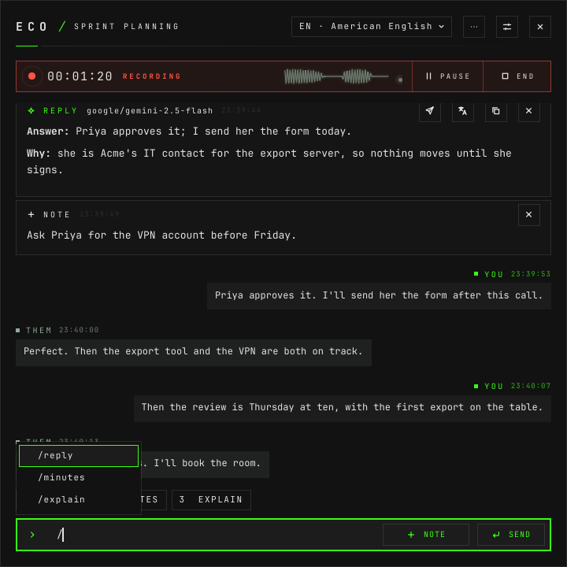

An answer waiting for its first word draws a loading trace and counts seconds,
`WAITING FOR THE MODEL · n S`, or `THINKING · n S` with the model's reasoning
under it while it reasons. A failed one stays, in red, saying why, until it is
removed. A skill with a hook has a send button on its card, and the card says
how sending went: SENDING…, SENT or NOT SENT.


The window follows the newest entry. Scrolled up, a `↓ N new` pill above the
composer counts what arrived below; a click or `End` goes back down.


Paused, the capsule turns amber and reads PAUSED, its time stopped, and PAUSE
becomes RESUME. END asks first:

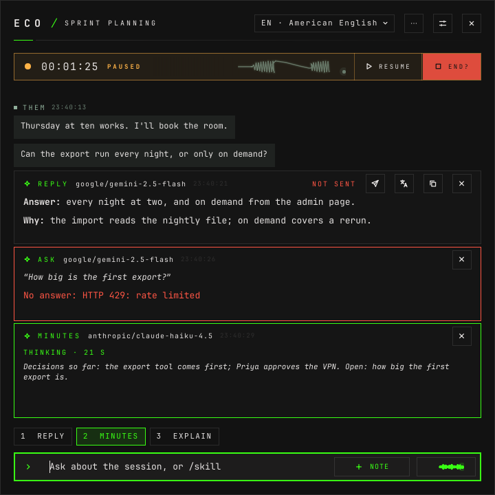

`END?` goes back to END after three seconds without a second click.

On a short window — the picture is 420×480 — the capsule joins the masthead
and the skill chips go (`Alt+1…9` still run them):


Under 560 px wide the capsule keeps icons only and the language picker moves
into the details; under 560 px tall the margins tighten and the skill chips
hide. The window goes down to 240×320.

| where | key | what it does |
|---|---|---|
| conversation | `↑` `↓` `PgUp` `PgDn` | move through lines, notes and answers |
| conversation | `Home` · `End` | the first or the last |
| conversation | `N` | name the speaker of the line |
| conversation | `Tab` | reach the line's tools |
| composer | `Enter` | send the question |
| composer | `Shift+Enter` | keep the text as a note |
| composer | `/` | list the skills: `↑` `↓` choose, `Tab` completes, `Enter` runs |
| composer | `Alt+1…9` | run the skill with that number |
| session | `E` | edit title and kind |
| anywhere | `Esc` | close what is open: a menu, a dialog, the details, then the session |

# 4. Finding it again

**SESSIONS**, or `H` on the start screen, or closing a session:

![The sessions list: the masthead "ECO / SESSIONS", HOME, IMPORT and PEOPLE buttons and "8 SESSIONS"; the search field "Search what was said, noted or answered… /"; a line of chips "LIVE 1", "ALL" lit, MEETING, CONVERSATION, OTHER, IDEA, INTERVIEW, a divider, "#Acme" and more tags cut at the edge; under LIVE, "Sprint planning · Meeting · Today 23:39 · 0 min · #Acme" with a green RECORDING dot; then day headings 10 MAR 2025, 07 MAR 2025, 05 MAR 2025, 04 MAR 2025, each row with its title, kind, date, length, tags, people, ENDED and a trash button.](img/11-sessions.png)

The live sessions come first, under LIVE, toned and with a dot before their
state; the others newest first under their day. Each row is title, kind,
start, length, tags, people and state. **No cost**, here or anywhere outside a
session's own details. A live row has no delete; an ended one has a trash can
that asks first.

The chips are one line that scrolls sideways: LIVE, the kinds (only when there
is more than one), and the tags. A tag's chip, right-clicked (or the menu key),
renames or deletes it in every session:


Renaming into a tag that exists says the two become one (that dialog is not
pictured); deleting asks first, saying how many sessions lose it:

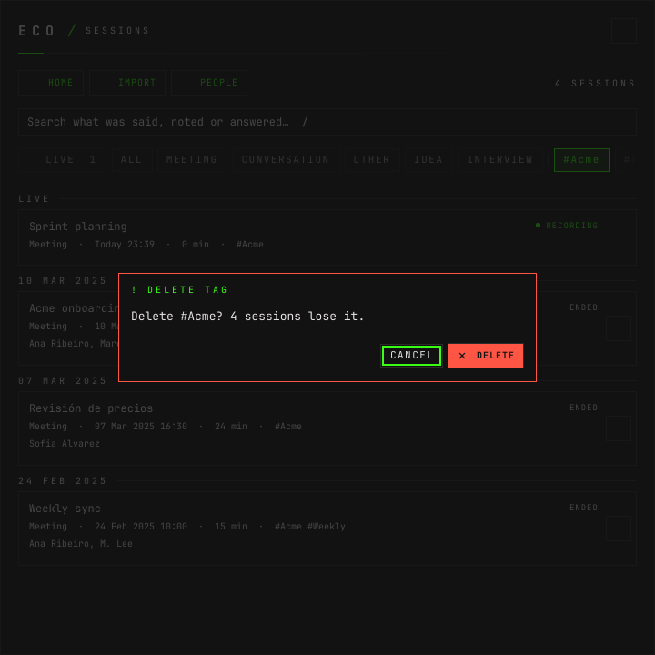

LIVE narrows the list to what is recording now, and says what is transcribing
it — the model, the language, and `×n` when one transcriber feeds several
sessions — so a second paid model never runs unseen:

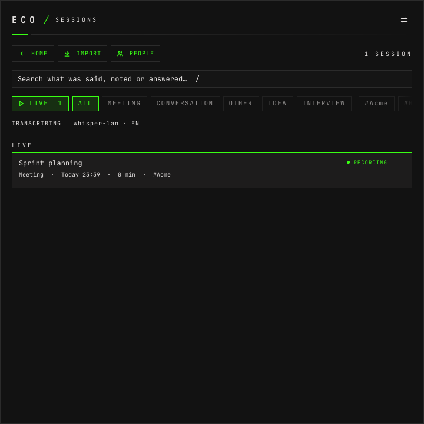

**This is the only place a live session shows.** Not on the start screen, and
not in another session's conversation. Opening its row puts it in this window.

The search field searches what was said, noted or answered in every session
(`/` from anywhere in the list):

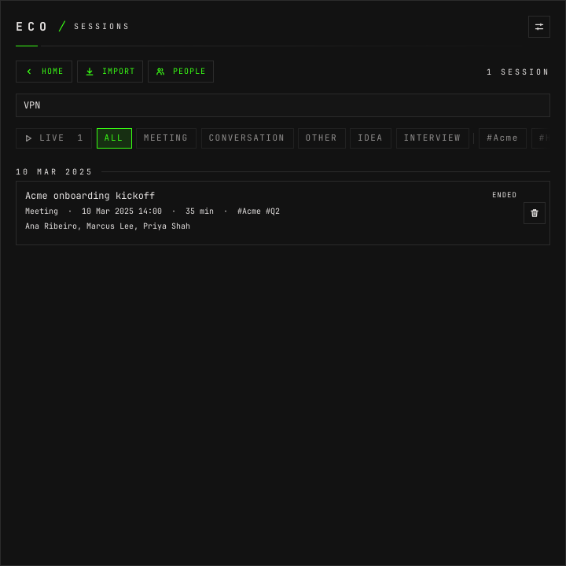

A search with nothing behind it says why, and offers the way back:


There is a different sentence for each empty list: `No session recorded yet.`
on a new machine, `No live session.` under LIVE, `No session matches these
filters.` for chips with no search. Until the first list arrives the table says
`Loading sessions…`. Only the search's is pictured. In a narrow window the
table stacks its fields; a person's chip, `PERSON: Ana Ribeiro ×`, appears when the list is
opened from People (section 9).

| key | what it does |
|---|---|
| `↑` · `↓` | choose a row (`↑` on the first goes back to the search) |
| `Enter` | open it |
| `Delete` | delete it, asking first |
| `I` | import a recording |
| `/` | search |
| `F2` · `Delete` · menu key | on a tag chip: rename, delete, or open its menu |
| `Esc` | back |

`P` opens People only on the start screen; here PEOPLE is the button.

# 5. A stored session

Opening a row puts the session on screen: **the same view as a live one**, with
one line where the capsule was:


That line says when it was, how long, and how much was said, and offers the way
back into it: REOPEN for an ended session, RESUME for a paused or interrupted
one (`R`). Either turns the line into the capsule. The composer works here too:
a question asked afterwards is answered from the stored transcript.

Each person keeps their colour across sessions; a speaker nobody has named
(`Speaker 3`) still gets one of their own.

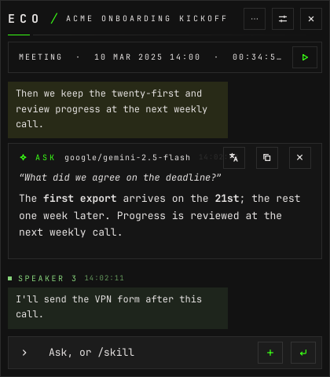

# 6. What a session is: the details

`⋯` in the masthead opens the details over the top of the conversation:

![The details panel of Acme onboarding kickoff: "ENDED · 10 MAR 2025 14:00 · 00:34:54 · 10 LINES · 2 ANSWERS · 1 NOTE" with the edit button; the path "/tmp/eco-shots/.local/share/eco/sessions/2025-03-10-140000-acme-onboarding-kickoff.jsonl" and COPY PATH; PEOPLE "Ana Ribeiro, Marcus Lee, Priya Shah" with a + button; SPEAKERS — Speaker 1 → Ana Ribeiro (CLEAR, CHANGE), Me (you) → No one yet (CHANGE), Speaker 2 → Marcus Lee (CLEAR, CHANGE), Speaker 3 → No one yet (CHANGE); TAGS "#Acme ×" "#Q2 ×" and "Add a tag"; CONTEXT with an unlit "resume" chip; "TRANSLATION: OFF"; and COST, COPY VTT and, in red, DELETE.](img/19-session-details.png)

Top to bottom: what the session is on one line, with the edit button (title and
kind; `E`); where its log is, for a stored session; the people in it; who each
speaker is; its tags; which context slots it sends; whether it translates; and
COST, COPY VTT (the transcript as WebVTT, to the clipboard) and DELETE. A live
session's DELETE is off.

**The edit button** opens `edit session`, the title and the kind:

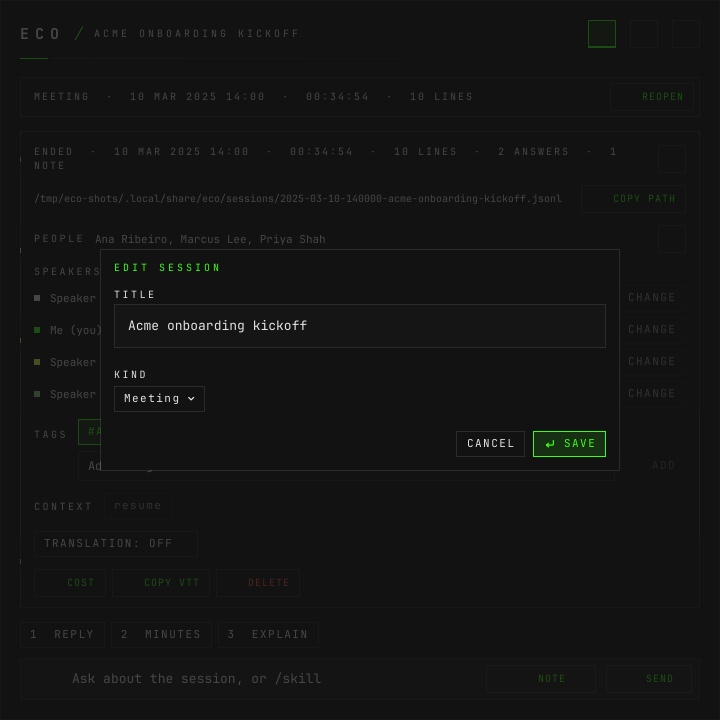

**PEOPLE `+`** opens the people dialog: those who are in the session because a
speaker is them (FROM SPEAKERS, and off, with the reason on hover), and under
ADD SOMEONE those added by hand — Priya Shah here — and everyone else known:

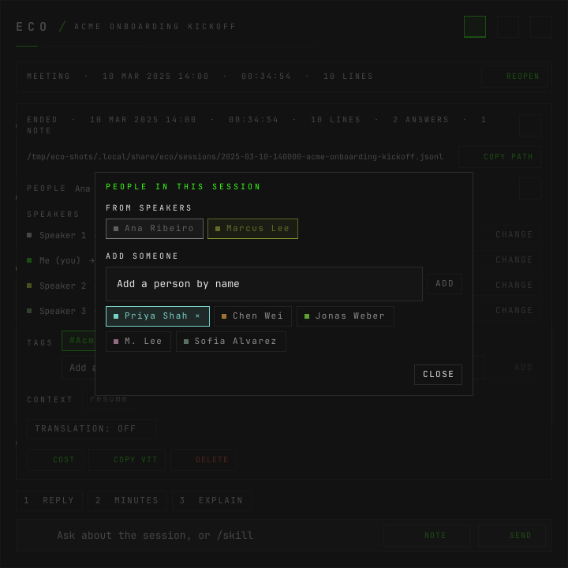

**DELETE** asks `Delete <title>?` and says the transcript, answers and voice
links go for good:

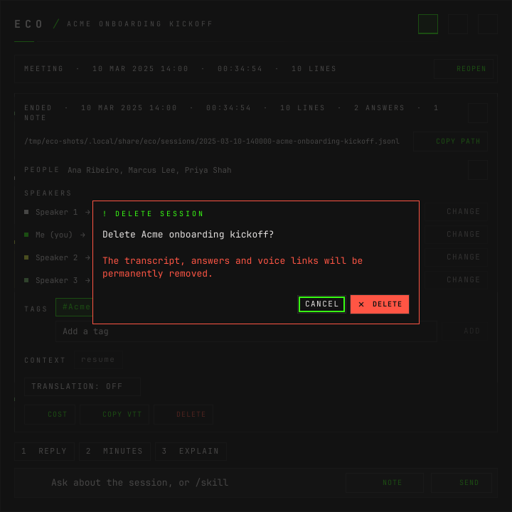

**When eco recognises a voice**, the session says so on one line, and REVIEW
opens the details at the speakers:


The guess is never applied on its own: the speaker's lines read `JONAS WEBER?`
until CONFIRM, and CLEAR drops it. On a short window the count moves onto the
details button.

**TRANSLATION** picks a language for this session only — any of the seventeen eco
knows but the session's own:


From then on every line and answer carries its translation under it:

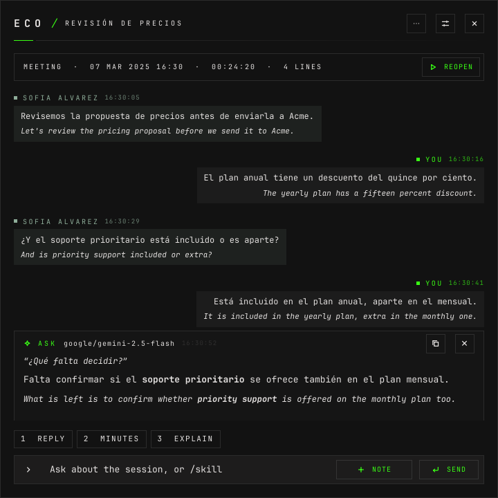

The model that translates is chosen in Settings › Translation; whether a
session translates is chosen only here.

# 7. Who is who

The SPEAKERS list of the details is the one place in the window that says who
each speaker is. CHANGE on a speaker, or clicking a speaker's name in the
conversation (`N` on a line), asks:


It offers the people the voice suggests first, with their score when the
session kept one, then everyone known, then a new name. It says how many lines
will change, as a warning when it is more than one. Opened from a line, APPLY
TO also offers THIS LINE, for a line the diarizer gave to the wrong speaker.
The colour changes a known person's colour everywhere, or keeps a colour for
this speaker in this session's log. Renaming a person to a name somebody else
has warns and offers to merge the two. **A person id is never on screen.**

# 8. What it cost

**COST** in the details, and only there:


The total, the LLM part split into answers, reviews and translations, and the
transcription with its minutes; then every charge, what it was for, when, which
model and how much. A charge the provider has not reported yet, or never will,
shows as `?` and a few words, with its reason said once in full above; a total
that leaves one out reads `≥`; and a figure estimated from a price per minute is
marked `≈`:


On a live session the screen follows the spending while open. SESSION or `Esc`
goes back.

**Cost is shown only when asked for inside a session.** The sessions list, the
answer cards and the masthead never carry it.

# 9. People

**PEOPLE**, or `P` on the start screen:


Everyone eco knows, with how many voices it keeps for them and how many sessions
they are in. Opening a person goes to SESSIONS filtered to them, with the
person's chip first among the filters; its × drops it:


Each row
changes the person's colour, renames them in every session, merges them, or
forgets them. The back button names where it goes: this one was opened from
SESSIONS.

**Merging** is two steps. MERGE on M. Lee asks who else he is, with CANCEL —
the one way out besides `Esc` while it waits; picking the same person says so.
Picking Marcus Lee asks which name stays:


SWAP turns the direction around. **FORGET** asks too, saying which voices are
deleted — eco will not recognise them again — and that the sessions keep the
name:


**ADD** adds somebody by a name nobody has:

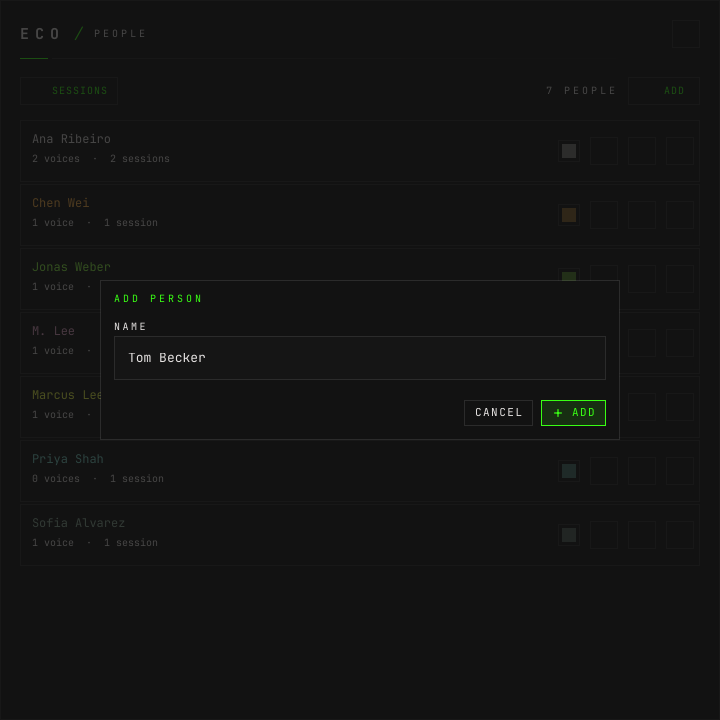

A name somebody already has is refused in the dialog. With nobody known, the
list says `No one yet. Name a live speaker or add someone to a session.` and
offers ADD. Below 420 px wide a row's four buttons fold into one `⋯` menu.

| key | what it does |
|---|---|
| `↑` · `↓` | choose |
| `Enter` | open their sessions |
| `Delete` | forget, asking first |
| `F2` | rename |
| `M` | merge with someone else |
| `Esc` | back |

# 10. Importing a recording

**IMPORT**, or `I` on the start screen or in SESSIONS, or dropping a file on the
window:

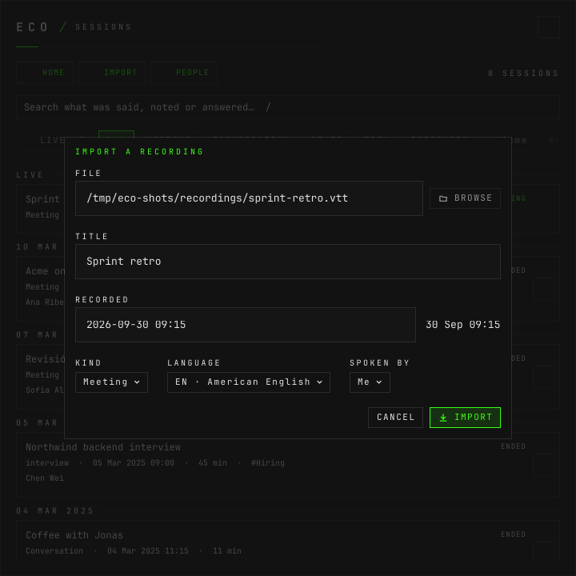

Any file `ffmpeg` decodes is transcribed into a new session; a WebVTT
transcript, like this one, becomes a session as it is, with no transcription.
BROWSE opens the file dialog; importing with no file says one is needed. SPOKEN
BY is the audio source the lines start as; a transcript that names its
speakers keeps them. While it runs, a strip on the start screen and in
SESSIONS shows the progress, and its × stops it; what was transcribed stays:


# 11. Finding your way around

`?` or `F1` lists every key, by where it works:


The dialog scrolls (arrows, `PgUp`, `PgDn`). Its end:


The GLOBAL keys are not the window's: `packaging/hypr/eco.lua` binds them in
Hyprland and sends them to the daemon through `socat` or to the window through
`quickshell ipc`, so they work with eco in the background.

Everything the pointer does, the keyboard does: `Tab` reaches every control,
with a focus ring apart from its hover, and a control's hint shows on focus as
on hover.

# 12. Settings

The settings button in any masthead, `SUPER+ALT+C`, opens the config window: a
second window, `eco · configuração` to Hyprland, 1040×760 or its screen less a
96-pixel margin when that is smaller, centred on the screen (the pictures are
1040×760). It
edits a draft. **SAVE** (`Ctrl+S`) sends the whole draft to the daemon, which
validates and writes it; the window never writes the config itself. DISCARD
goes back to what is saved. What keeps the draft from saving, and closing it
unsaved, are at the end of this section.

Eight tabs, `Ctrl+1` to `Ctrl+8`. **Each owns its own fields**; a tab that
depends on another only reads it.

**Audio** — who is heard, and through what:


One card per source: its name, whether it is the user, and its PipeWire devices
with their colour and kind. Each device also carries a live trace and is marked
when missing; under `--replay` the daemon lists no devices, so the picture has
neither. ADD DEVICE lists every device, and who has it now:


A device has one owner: picking one that another source has moves it here. Removing a
source asks first, naming who is no longer heard.

**Models** — every model, registered once:


A closed card is its type, the provider's id and what uses it. Open, it edits
the provider, the model, where the key comes from (an environment variable or
an omapass password), reasoning and extra JSON for chat. Without omapass on the
machine, as in these pictures, **OMAPASS** is off and an info button beside it
opens omapass's install page:


 The assistant's and
the default transcription have no ×; removing another asks first, saying what
falls back to which model.

**Transcription** — the default transcriber and the spoken languages:


**Answers** — the assistant, its rules, and what it is told:


The page scrolls: below the slots are the reviewer (on, verbose, its model and
prompt) and the limits — context size and how many answers run at once, across
all sessions:


**Skills** — what the composer's chips do:


The order here is the order of the chips and of `Alt+1…9`. A skill with no
model of its own names the one it inherits. Open, a card edits the name, the
prompt, the format, the model and its hook:


Renaming or removing one warns that Hyprland shortcuts call skills by name.

**Translation** — only the model:


**Sessions** — the kinds, and what each runs on:


The first kind is the default the start and import dialogs suggest. Open, a
card renames the kind, makes it the default, and gives it its own
transcription, assistant and translation models. Removing one says its sessions
keep it.

**Interface** — the interface language, and whether eco hides from screen
sharing:


English, Brazilian Portuguese or Japanese, or `auto` to follow the system;
see [i18n.md](i18n.md). HIDE FROM SCREEN SHARING is off by default; on, it
applies to every eco window at once, and to each one that opens later.

**What keeps the draft from saving** shows on its own field: an outline in the
error colour and the reason under it, and a dot on the tab that holds it. A
repeated name or a space in a skill's name shows as it is typed; a missing value
once a save is tried. The line above the buttons only counts them:


**Closing with unsaved changes** asks:

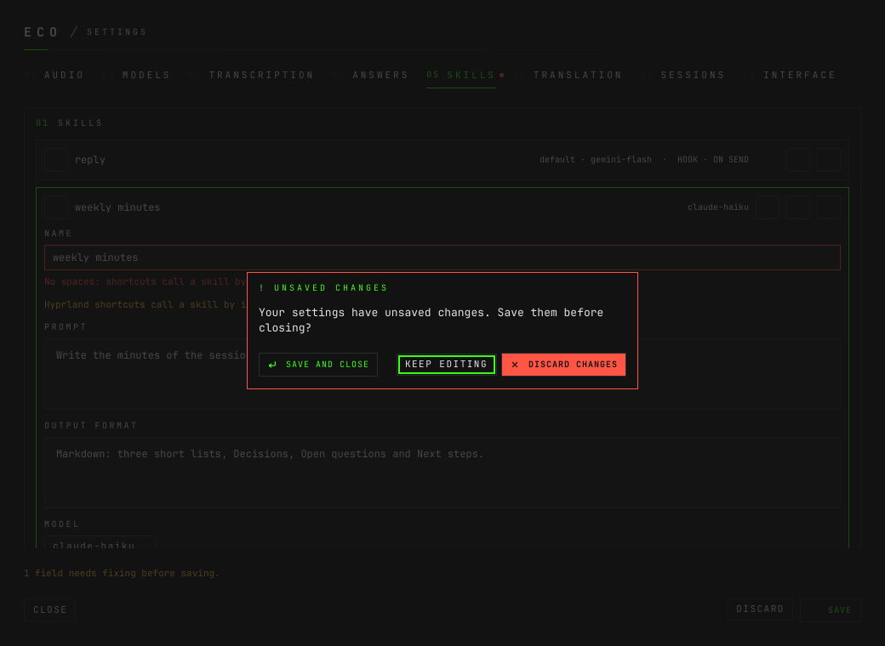

**A change another program asked for.** Only this window's own SAVE writes at
once a new or changed skill hook, a new context file, or a new model or a
model's new address or key source. When another program on the socket sends a
config that does (an agent, a script), the daemon holds it and every eco window
asks, naming each hook command, each file path, and each model's address and
where its key comes from (never the key):


**APPROVE** saves the change; **REJECT** drops it, and the status line says it
was rejected. Esc and a press outside do not close it. The keyboard starts on
REJECT. The daemon keeps one held change at a time, and drops it when a config
is saved. In these pictures the driver hands the window the daemon's
`config_pending` event (`docs/design.md §9`); nothing was sent to the socket.

# 13. What has no screen

Some things belong on this walk by their absence, so that somebody looking for
them finds out there is nothing to find.

**The audio.** There is no player and no waveform of a session, because there
is no audio to play: eco never writes raw audio to disk. A session is its
transcript, its answers and its notes. Outside a session the trace on the start
screen is a measurement and nothing else.

**Cost outside a session.** Not in the sessions list, not on an answer card,
not in a tooltip. It is the cost screen of section 8, opened from one
session's details. `eco sessions` prints it for agents.

**Assigning every line of a session to one person at once.** The window assigns
one speaker or one line; `eco assign <id> all` does the whole session.

**Linking older sessions to people in bulk.** `eco people adopt` links the
named live speakers of older sessions to people. The window has no button for
it.

**A transcript as a file.** COPY VTT puts the WebVTT on the clipboard;
`eco export <id> > session.vtt` writes it.

**The daemon itself.** Starting, stopping and restarting are `eco start`,
`eco stop` and `eco restart`; the window shows only whether it can reach the
daemon. Its errors go to `journalctl --user -u eco.service`.

**Hyprland's shortcuts.** The window lists them (section 11) but does not
change them: they are in `packaging/hypr/eco.lua`, and the skills they call by
name are the config's.

**Measurements.** `eco bench` and `mise run bench` print to the terminal; see
[benchmarks.md](benchmarks.md).

**Two sessions in one window.** A window shows one session. Opening the app
again opens another window to start the next one in, and SESSIONS › LIVE is
where every live session can be found.
